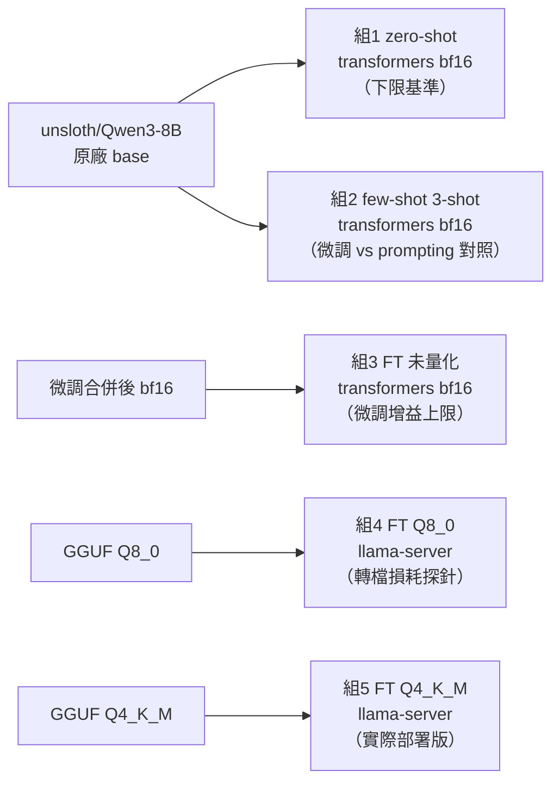
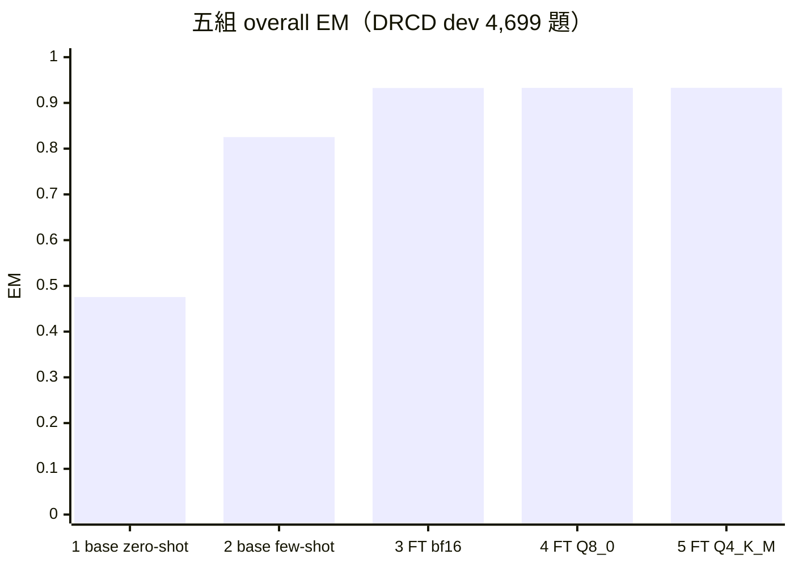
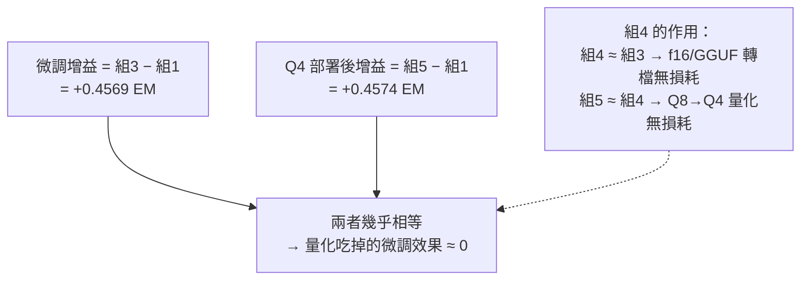
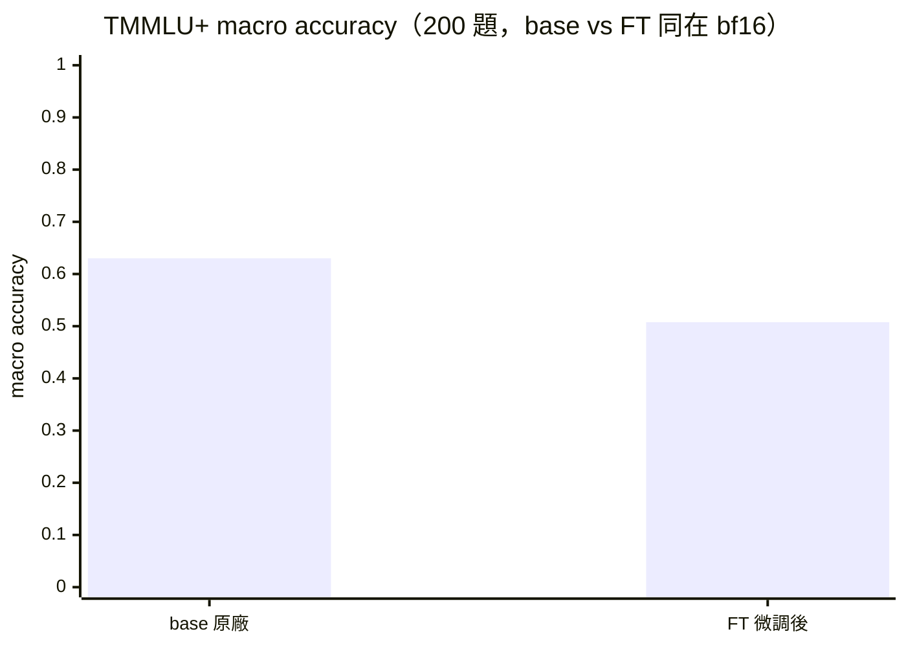

# EVAL_REPORT：五組對照評估與 Forgetting Check

> 對應 PLAN.md Phase 5。回答本專案的核心問題：**量化會吃掉多少微調效果？**

**一句話結論**：QLoRA 微調把 EM 從 0.476（原廠 zero-shot）拉到 0.933，量化到 Q4_K_M 部署版之後
增益幾乎完全保留（0.933，掉不到 0.03 個百分點）——**Q4 量化幾乎沒吃掉微調效果**。但微調本身
不是沒有代價：TMMLU+ 通用知識測驗的 macro accuracy 從 0.630 掉到 0.508，掉了 12.25 個百分點，
確認存在明顯的 catastrophic forgetting。

---

## 1. 評估設定

- **考卷**：DRCD 官方 dev split，完整 **4,699 題**（3,524 題可回答 + 1,175 題從 dev 獨立合成的
  unanswerable 負例，來源段落跟訓練負例不重疊），未經抽樣，五組共用同一份考卷、同一組 qid。
- **指標**：CMRC2018 風格字元級 EM/F1（中文逐字、英數整詞切分，多參考答案取 max）、JSON 合法率、
  answerable flag 準確率（含單獨的 unanswerable 準確率）。SQuAD 2.0 慣例：gold 為 unanswerable
  時，只有預測也給空字串才算 EM=F1=1。
- **推論設定**：全組 `temperature=0`（greedy decoding）、`enable_thinking=False`；組 1/2/3 走
  transformers bf16，組 4/5 走 llama-server（`--jinja`，OpenAI 相容 API，`-np 8` continuous
  batching）。
- **base 組刻意用 `unsloth/Qwen3-8B`**（不是官方 `Qwen/Qwen3-8B`）——這是 LoRA 實際合併時的
  起點權重（見 `scripts/20_merge_lora.py`），同一份 base 才能讓「組3−組1」乾淨地只反映微調本身，
  不混入 unsloth tokenizer 修正版跟官方版之間的差異。
- 詳細方法論、chat template 驗證見 PLAN.md §4.4、§4.5。

---

## 2. 五組對照結果

同一份考卷（DRCD dev 完整 4,699 題）考五種設定：

| # | 組別 | 權重/引擎 | overall EM | overall F1 | hasans EM | hasans F1 | noans 準確率 | answerable flag 準確率 | JSON 合法率 |
|---|------|-----------|-----------:|-----------:|----------:|----------:|-------------:|------------------------:|-------------:|
| 1 | base zero-shot | Qwen3-8B 原廠 / transformers | 0.4756 | 0.6858 | 0.4157 | 0.6960 | 0.6553 | 0.9308 | 95.62% |
| 2 | base few-shot（3-shot） | Qwen3-8B 原廠 / transformers | 0.8253 | 0.9191 | 0.7940 | 0.9191 | 0.9191 | 0.9783 | 99.98% |
| 3 | **FT 未量化** | 合併後 bf16 / transformers | **0.9325** | **0.9704** | 0.9152 | 0.9656 | 0.9847 | 0.9940 | 100% |
| 4 | FT Q8_0 | GGUF / llama-server | 0.9328 | 0.9706 | 0.9154 | 0.9659 | 0.9847 | 0.9940 | 100% |
| 5 | **FT Q4_K_M（部署版）** | GGUF / llama-server | **0.9330** | **0.9700** | 0.9149 | 0.9643 | 0.9872 | 0.9932 | 100% |

（n=4,699，其中 hasans 3,524 題、noans 1,175 題；原始逐題結果見 `results/eval_raw/*.jsonl`）

### 觀察

- **微調 vs 提示工程**：純 few-shot 提示（組2）比 zero-shot 大幅提升 +0.35 EM，證明提示工程確實
  有效，但仍明顯輸給微調（組3，再拉開 +0.11 EM）——對這個「格式嚴格、需要精確片段抽取」的任務，
  微調的優勢很清楚。
- **JSON 合法率是被低估的基準線問題**：base zero-shot 有 4.4% 的輸出**格式不合法**（不是答錯，是
  連 JSON 都解析不出來），few-shot 把這個問題幾乎完全解決（99.98%），微調後三組全部 100%——這代表
  base 模型在這個任務上的「下限基準」其實比 0.4756 這個數字看起來更差：字面上有 4.4% 的題目是連
  可用的答案格式都生成不出來，直接算錯。
- **unanswerable 判斷是微調前後差距最大的子項**：base zero-shot 的 `noans_accuracy`（該拒答卻拒答
  的比例）只有 0.6553，微調後拉到 0.98+——base 模型明顯有「寧可亂猜也不拒答」的傾向。

---

## 3. 核心問題：Q4 吃掉多少微調增益？

定義：**微調增益 = 組3（FT 未量化）− 組1（base zero-shot）**；**Q4 部署後的增益 = 組5（FT
Q4_K_M）− 組1**。兩者的差，就是量化吃掉的部分。

| 指標 | 組3−組1（微調增益上限） | 組5−組1（Q4 部署後增益） | 量化吃掉的比例 |
|------|------------------------:|---------------------------:|---------------:|
| EM | +0.4569 | +0.4574 | **≈ 0%（實際還微幅為正）** |
| F1 | +0.2846 | +0.2842 | **≈ 0.1%** |

**答案：量化（f16 → Q8_0 → Q4_K_M）幾乎沒有吃掉微調效果。** 組3/組4/組5 三組的 EM/F1 數字幾乎
重疊在雜訊範圍內（組5 的 EM 甚至比組3 高 0.0004，方向上完全在測量雜訊內，不代表 Q4 比未量化更
好）。

**損耗來源切分**（組4 的作用）：

- f16/GGUF 轉檔 → Q8_0（近無損量化）：組4 EM 0.9328 vs 組3 EM 0.9325，**沒有損耗**（轉檔本身
  沒有引入額外誤差，Phase 4 的五步 template 驗證協定已經先排除了「轉檔壞掉」的可能性，這裡是在
  數字上再次確認）
   &emsp;→ 4.4 節有一個容易誤解的地方要說清楚：`40_verify_template.py` 驗證的是「文字
  跟 token 層級的一致性」，這裡的 EM/F1 比較驗證的是「下游任務表現層級的一致性」，兩者互補，
  結論一致：轉檔沒有破壞任何東西。
- Q8_0 → Q4_K_M：組5 EM 0.9330 vs 組4 EM 0.9328，**同樣沒有可觀測的損耗**。

對這個特定任務（繁中抽取式 QA，答案是原文連續片段、格式固定）而言，8B 模型量化到 Q4_K_M 是「幾乎
免費」的部署選擇——這跟社群對 Q4_K_M「近乎無損」的普遍認知一致，本專案用完整 4,699 題的下游任務
表現數字加以驗證。

---

## 4. Forgetting Check：TMMLU+ 通用知識

微調雖然沒有被量化吃掉，但微調本身是有代價的。用 TMMLU+（Taiwan-specific MMLU）66 科目均勻抽樣
200 題，**base 跟 FT 都在 transformers bf16 下比較**（隔離微調這一個變因，量化不參與這個比較）。

| | n | 科目數 | macro accuracy | micro accuracy |
|---|---:|---:|---:|---:|
| base（Qwen3-8B 原廠） | 200 | 66 | 0.6301 | 0.6300 |
| FT（DRCD QLoRA 微調後） | 200 | 66 | 0.5076 | 0.5050 |
| **Δ（FT − base）** | | | **−0.1225** | **−0.1250** |

**確認存在明顯的 catastrophic forgetting**：2 epochs、~10k 筆 QA 資料的 QLoRA 微調，讓模型在
TMMLU+ 上的 macro accuracy 掉了 12 個百分點以上。已排除是評估腳本的效能異常造成的假象——抽查
`tmmlu_ft.jsonl` 的原始輸出全部是乾淨的單一字母作答，沒有空值或格式錯誤，退步是真實發生在模型的
回答內容上。

退步最明顯的科目（部分列表，delta = FT − base）：

| 科目 | base | FT | Δ |
|---|---:|---:|---:|
| tve_natural_sciences | 1.00 | 0.33 | −0.67 |
| administrative_law | 1.00 | 0.33 | −0.67 |
| human_behavior | 1.00 | 0.33 | −0.67 |
| junior_math_exam | 0.67 | 0.00 | −0.67 |
| traditional_chinese_medicine_clinical_medicine | 0.67 | 0.00 | −0.67 |

也有少數科目 FT 略有進步（`general_principles_of_law`、`junior_chemistry`、`physics` 等 +0.33），
但退步的科目數量與幅度明顯更大、更一致，不是隨機雜訊可以解釋的方向。

**解讀**：退步的科目橫跨數學、自然科學、法律、醫學、人文行為等完全不相關的領域，符合「窄任務
微調擠壓通用能力」的典型 catastrophic forgetting 特徵，而不是某個特定知識領域被覆蓋。訓練 loss
在 Phase 3 收斂到接近 0（step 1200 時 train loss 0.005，見下方 W&B 截圖），模型對 DRCD QA 這個
狹窄任務的擬合非常緊——這解釋了下游 QA 表現極好的同時，通用能力被明顯壓縮。

**跟第 3 節對照**：量化幾乎零副作用，微調本身的副作用（forgetting）遠大於量化的副作用。這是這份
報告除了「Q4 幾乎無損」之外的第二個核心發現。

### 訓練曲線（W&B，Phase 3 全量訓練）

`train/loss` 在前 ~50 步從 1.1 驟降到 0.05 附近並持續下探到 0.005（1226 步收斂），`eval/loss`
穩定收斂到 0.017-0.018、無過擬合反彈的跡象——訓練本身收斂健康，forgetting 是「收斂太緊」的
副作用，不是訓練不穩定的症狀。完整 run：
[wandb.ai/tunyu1/qwen3-drcd-qlora/runs/e8h2wq6x](https://wandb.ai/tunyu1/qwen3-drcd-qlora/runs/e8h2wq6x)

---

## 5. 錯誤案例分析

抽樣自 `results/eval_raw/*.jsonl` 的真實案例，涵蓋不同失敗型態。

### 案例 1：JSON 格式不合法（base zero-shot）

- qid `6152-2-3-neg`（gold: unanswerable）
- 模型輸出：`{"answer": "answerable": false}`
- 結構性錯誤：漏掉了 `answer` 欄位該有的空字串跟逗號，變成 `"answer"` 直接接 `"answerable"`，
  JSON 解析直接失敗。這正是 base 模型 4.4% JSON 不合法率的典型成因——不是內容錯，是格式跑掉。

### 案例 2：extraction 不夠精確，多打了字（base zero-shot vs FT，同一題）

- qid `1149-12-1`，問題：「台灣第一座採用花崗石建造的洋式燈塔於何時建立？」
- gold：`西元1872年` / `1872年`
- base zero-shot 輸出：`{"answer": "東犬燈塔創建於西元1872年", "answerable": true}`——語意完全
  正確，但多包含了主詞「東犬燈塔創建於」，不是「連續原文片段、一字不改」的精確抽取，EM=0
  （F1 有部分分數）
- FT Q4_K_M 輸出：`{"answer": "西元1872年", "answerable": true}`——精確符合要求，EM=1
- 這類案例說明微調帶來的增益有一部分不是「知不知道答案」，而是「知道答案後能不能精確遵守抽取
  格式」——這在字元級 EM 這種嚴格指標下影響很大。

### 案例 3：answerable 誤判——該拒答卻幻覺出答案（false positive，FT Q4_K_M）

- qid `6292-57-2-neg`，問題：「大多數現今在香港的廣東人是在哪一年之後才抵港的?」（gold:
  unanswerable，文章中沒有這個資訊）
- 模型輸出：`{"answer": "1950年", "answerable": true}`——幻覺出一個看似合理但文章中不存在的
  年份

### 案例 4：answerable 誤判——該回答卻拒答（false negative，FT Q4_K_M）

- qid `1190-1-2`，問題：「西德的領土在什麼時候增加了約十萬平方公里？」
- gold：`1990年10月3日`（文章中確實有這個答案）
- 模型輸出：`{"answer": "", "answerable": false}`——誤判為無法回答，屬於過度保守拒答

### Answerable 誤判方向統計（FT Q4_K_M，部署版，n=4,699）

| 誤判方向 | 題數 | 佔比 |
|---|---:|---:|
| gold unanswerable → 誤判 answerable（幻覺，案例3 型） | 15 | 0.32% |
| gold answerable → 誤判 unanswerable（過度拒答，案例4 型） | 17 | 0.36% |

兩個方向的誤判數量接近（15 vs 17），**沒有明顯偏向某一種錯誤**，整體 answerable flag 準確率
99.32%——量化部署版在這個子任務上維持了微調的水準，兩種誤判都屬於少數的邊界案例，不是系統性
偏誤。

### 案例 5：TMMLU+ forgetting 的具體樣態

- 科目 `junior_math_exam`（國中數學會考）：base 答對率 0.67 → FT 降到 0.00（3 題全錯）
- 這類題目跟 DRCD QA（閱讀理解、抽取式作答）在任務型態上完全無關，FT 模型在這裡的全面失分
  說明微調不是「學壞了某個特定領域的知識」，而是模型整體上更傾向套用「閱讀文章、抽取片段、
  輸出固定 JSON」這種行為模式，遇到選擇題這種不同格式的任務時泛化能力下降。

---

## 6. 方法論註記與已知限制

- **base 組模型選擇**：用 `unsloth/Qwen3-8B` 而非官方 `Qwen/Qwen3-8B`，理由見第 1 節；意味著
  這份報告的「微調增益」數字，量的是「這一版經過 unsloth tokenizer 修正的 base」到「微調後」的
  差距，跟官方版 base 比較可能有些微差異（未實測量化）。
- **TMMLU+ 樣本量**：200 題（66 科目均勻抽樣，每科目 3-4 題）用於快速偵測 forgetting 的方向與
  量級，不是完整的 22,690 題全量評估，單一科目 3-4 題的準確率數字（如「退步最多」表格）本身
  雜訊較大，科目排名僅供參考；宏觀方向（macro accuracy 顯著下降）在這個樣本量下已經足夠穩健。
- **評估腳本效能踩雷**：`base_fewshot` 組第一次跑撞到固定 batch size 在長 prompt 下的顯存碎片化
  問題（慢 30+ 倍且結果被作廢重跑），`51_eval_tmmlu.py` 也撞到同一種病；兩者都已修復（動態
  token 預算 batch + `PYTORCH_CUDA_ALLOC_CONF=expandable_segments:True`），詳細除錯過程記錄在
  PLAN.md Phase 5 實作紀錄。這些是工程過程中的踩雷，**不影響本報告任何數字的正確性**（已逐一
  驗證：效能異常只拖慢速度，不改變 greedy decoding 的運算結果）。
- **llama-server 版本**：組4/5 使用的 llama.cpp build 版本、GGUF 檔案 SHA 對應 Phase 4 產出，
  詳見 PLAN.md Phase 4 實作紀錄；未在本報告重複記錄 build commit。
