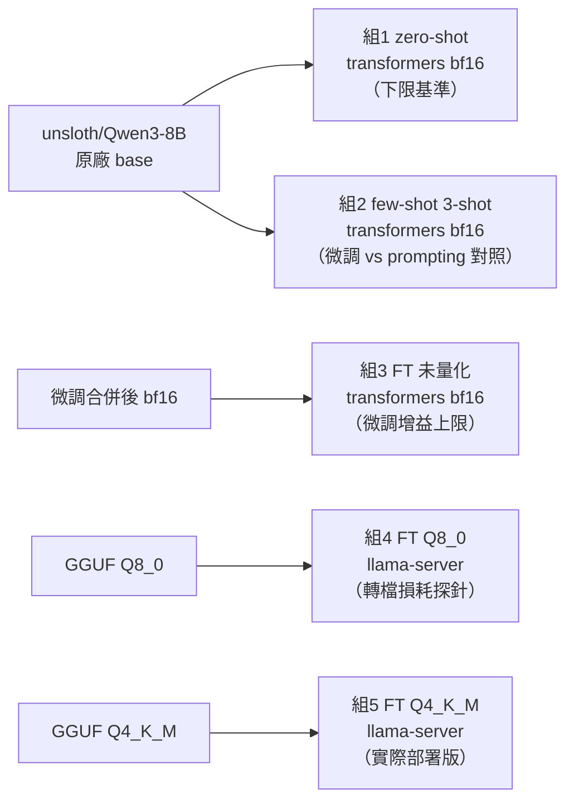
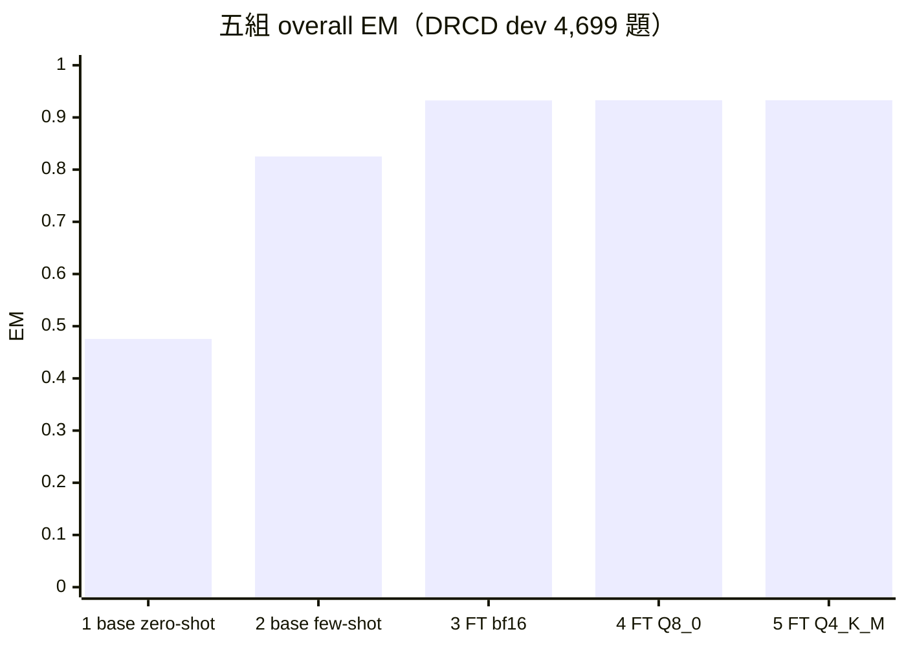
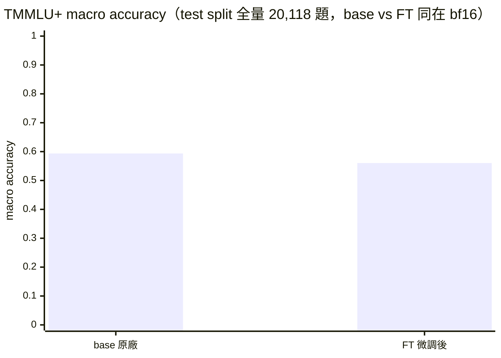
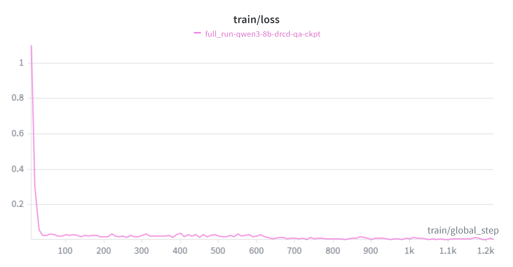
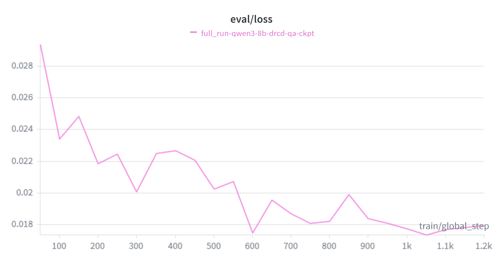

# EVAL_REPORT：五組對照評估與 Forgetting Check

> 對應 README 的完整評測階段。回答本專案的核心問題：**量化會吃掉多少微調效果？**

**一句話結論**：QLoRA 微調把 EM 從 0.476（原廠 zero-shot）拉到 0.933，量化到 Q4_K_M 部署版之後
增益幾乎完全保留——**量化最多吃掉微調增益的 0.65%**（EM，95% CI 下界；點估計實際還微幅為正）。
不過量化並非 no-op：2.68% 題目的答案文字確實變了，只是變好與變壞互相抵銷（§3.2）。微調本身
有代價但不大：TMMLU+ 全量 20,118 題上 macro accuracy 從 0.5936 掉到 0.5604，
**Δ = −3.32 個百分點，95% CI [−3.96, −2.69]**；而且退步的型態是**選項偏誤**
（FT 少選 B、多選 D，gold=D 的題目反而進步 7.7 pp），不是通用知識被抹除——
把選項順序隨機化後投票，可以**回收其中 45%**（+1.54 pp，95% CI [+0.90, +2.19]，
160,880 次推論實測）。

> **這份報告修正過自己。** 先前版本用 200 題（每科 3 題）得到 −12.25 pp 並宣稱
> 「明顯的 catastrophic forgetting」。全量重跑後量級是 −3.32 pp，逐科目的敘事幾乎全錯
> （舊版列為「略有進步」的科目，全量之後是退步最嚴重的一科）。
> 完整的錯誤剖析見 [§4.3](#43-先前-200-題版本錯在哪)。

---

## 1. 評估設定

- **考卷**：DRCD 官方 dev split，完整 **4,699 題**（3,524 題可回答 + 1,175 題從 dev 獨立合成的
  unanswerable 負例，來源段落跟訓練負例不重疊），未經抽樣，五組共用同一份考卷、同一組 qid。
- **指標**：CMRC2018 風格字元級 EM/F1（中文逐字、英數整詞切分，多參考答案取 max）、JSON 合法率、
  answerable flag 準確率（含單獨的 unanswerable 準確率）。SQuAD 2.0 慣例：gold 為 unanswerable
  時，只有預測也給空字串才算 EM=F1=1。
- **推論設定**：全組 `temperature=0`（greedy decoding）、`enable_thinking=False`；組 1/2/3 走
  transformers bf16，組 4/5 走 llama-server（`--jinja`，OpenAI 相容 API，`-np 8` continuous
  batching）。
- **base 組刻意用 `unsloth/Qwen3-8B`**（不是官方 `Qwen/Qwen3-8B`）——這是 LoRA 實際合併時的
  起點權重（見 `scripts/20_merge_lora.py`），同一份 base 才能讓「組3−組1」乾淨地只反映微調本身，
  不混入 unsloth tokenizer 修正版跟官方版之間的差異。
- 詳細方法論見本報告；chat template 驗證協定見 `scripts/40_verify_template.py`。

---

## 2. 五組對照結果

同一份考卷（DRCD dev 完整 4,699 題）考五種設定：





| # | 組別 | 權重/引擎 | overall EM | overall F1 | hasans EM | hasans F1 | noans 準確率 | answerable flag 準確率 | JSON 合法率 |
|---|------|-----------|-----------:|-----------:|----------:|----------:|-------------:|------------------------:|-------------:|
| 1 | base zero-shot | Qwen3-8B 原廠 / transformers | 0.4756 | 0.6858 | 0.4157 | 0.6960 | 0.6553 | 0.9308 | 95.62% |
| 2 | base few-shot（3-shot） | Qwen3-8B 原廠 / transformers | 0.8253 | 0.9191 | 0.7940 | 0.9191 | 0.9191 | 0.9783 | 99.98% |
| 3 | **FT 未量化** | 合併後 bf16 / transformers | **0.9325** | **0.9704** | 0.9152 | 0.9656 | 0.9847 | 0.9940 | 100% |
| 4 | FT Q8_0 | GGUF / llama-server | 0.9328 | 0.9706 | 0.9154 | 0.9659 | 0.9847 | 0.9940 | 100% |
| 5 | **FT Q4_K_M（部署版）** | GGUF / llama-server | **0.9330** | **0.9700** | 0.9149 | 0.9643 | 0.9872 | 0.9932 | 100% |

（n=4,699，其中 hasans 3,524 題、noans 1,175 題；原始逐題結果見 `results/eval_raw/*.jsonl`）

### 觀察

- **微調 vs 提示工程**：純 few-shot 提示（組2）比 zero-shot 大幅提升 +0.35 EM，證明提示工程確實
  有效，但仍明顯輸給微調（組3，再拉開 +0.11 EM）——對這個「格式嚴格、需要精確片段抽取」的任務，
  微調的優勢很清楚。
- **JSON 合法率是被低估的基準線問題**：base zero-shot 有 4.4% 的輸出**格式不合法**（不是答錯，是
  連 JSON 都解析不出來），few-shot 把這個問題幾乎完全解決（99.98%），微調後三組全部 100%——這代表
  base 模型在這個任務上的「下限基準」其實比 0.4756 這個數字看起來更差：字面上有 4.4% 的題目是連
  可用的答案格式都生成不出來，直接算錯。
- **unanswerable 判斷是微調前後差距最大的子項**：base zero-shot 的 `noans_accuracy`（該拒答卻拒答
  的比例）只有 0.6553，微調後拉到 0.98+——base 模型明顯有「寧可亂猜也不拒答」的傾向。

---

## 3. 核心問題：Q4 吃掉多少微調增益？

定義：**微調增益 = 組3（FT 未量化）− 組1（base zero-shot）**；**Q4 部署後的增益 = 組5（FT
Q4_K_M）− 組1**。兩者的差，就是量化吃掉的部分。

| 指標 | 組3−組1（微調增益上限） | 組5−組1（Q4 部署後增益） | 量化吃掉的比例 |
|------|------------------------:|---------------------------:|---------------:|
| EM | +0.4569 | +0.4573 | **≈ 0%（實際還微幅為正）** |
| F1 | +0.2845 | +0.2842 | **≈ 0.1%** |

**答案：量化（f16 → Q8_0 → Q4_K_M）幾乎沒有吃掉微調效果。** 組3/組4/組5 三組的 EM/F1 數字幾乎
重疊在雜訊範圍內（組5 的 EM 甚至比組3 高 0.0004，方向上完全在測量雜訊內，不代表 Q4 比未量化更
好）。

### 3.1 這是個 null result，所以要給等價界

「沒有差異」最容易被質疑的方式是「你只是沒有檢定力去偵測它」。所以除了點估計，還要說明
**這份資料容許的最壞情況是多少**。五組跑同一份 4,699 題考卷、同一組 qid，逐題 EM/F1 都已落盤，
所以是配對資料（[`scripts/56_drcd_paired_stats.py`](scripts/56_drcd_paired_stats.py)，
配對分層 bootstrap 10,000 次，分層在 answerable 上以維持 3,524/1,175 的考卷結構，零 GPU）：

| 對照 | Δ EM | 95% CI | Δ F1 | 95% CI |
|---|---:|---:|---:|---:|
| Q8_0 vs 未量化（GGUF 轉檔） | +0.021 pp | [−0.15, +0.17] | +0.022 pp | [−0.05, +0.10] |
| Q4_K_M vs Q8_0（Q8→Q4 量化） | +0.021 pp | [−0.32, +0.38] | −0.055 pp | [−0.28, +0.17] |
| **Q4_K_M vs 未量化（總損耗）** | **+0.043 pp** | **[−0.30, +0.38]** | **−0.033 pp** | **[−0.25, +0.19]** |
| 微調增益（組3−組1） | +45.691 pp | [+44.20, +47.14] | +28.453 pp | [+27.40, +29.50] |

三個量化對照的 CI 都包含 0，微調增益的 CI 離 0 極遠。把兩者放在一起就能給出一句可引用的話：

> **量化最多吃掉微調增益的 0.65%（EM）／0.87%（F1）**——這是 95% CI 下界允許的最壞情況
> （EM −0.298 pp ÷ 增益 45.691 pp），不是點估計。

### 3.2 但量化不是 no-op：2.68% 的答案其實變了

整體指標沒動，不代表逐題結果沒動。同樣用配對資料逐題比對：

| 對照 | 答案文字不同 | EM 改變 | 變好 / 變壞 | McNemar p |
|---|---:|---:|---:|---:|
| Q8_0 vs 未量化 | 28 題（0.60%） | 15 題 | 7 / 8 | 1.000 |
| **Q4_K_M vs 未量化** | **126 題（2.68%）** | 68 題 | 33 / 35 | 0.904 |
| Q4_K_M vs Q8_0 | 126 題（2.68%） | 67 題 | 33 / 34 | 1.000 |

**Q4 量化改變了 2.68% 題目的答案文字**，只是變好與變壞的題數幾乎相等（33 vs 35），
互相抵銷之後整體指標才看起來沒動。所以正確的說法不是「量化沒有影響」，而是
**「量化的影響在這個任務上沒有方向性」**——它是雜訊，不是系統性劣化。
McNemar p ≈ 0.9，完全無法拒絕「變好與變壞等機率」。

這個區分有實務意義：如果你的應用對**個別答案的穩定性**敏感（例如需要與既有結果逐字一致），
2.68% 的變動率是要納入考量的；如果你只在意**整體品質**，那量化確實幾乎免費。


**損耗來源切分**（組4 的作用）：

- f16/GGUF 轉檔 → Q8_0（近無損量化）：組4 EM 0.9328 vs 組3 EM 0.9325，**沒有損耗**（轉檔本身
  沒有引入額外誤差，Phase 4 的五步 template 驗證協定已經先排除了「轉檔壞掉」的可能性，這裡是在
  數字上再次確認）
  <br>&emsp;→ 4.4 節有一個容易誤解的地方要說清楚：`40_verify_template.py` 驗證的是「文字
  跟 token 層級的一致性」，這裡的 EM/F1 比較驗證的是「下游任務表現層級的一致性」，兩者互補，
  結論一致：轉檔沒有破壞任何東西。
- Q8_0 → Q4_K_M：組5 EM 0.9330 vs 組4 EM 0.9328，**同樣沒有可觀測的損耗**。

對這個特定任務（繁中抽取式 QA，答案是原文連續片段、格式固定）而言，8B 模型量化到 Q4_K_M 是「幾乎
免費」的部署選擇——這跟社群對 Q4_K_M「近乎無損」的普遍認知一致，本專案用完整 4,699 題的下游任務
表現數字加以驗證。

---

## 4. Forgetting Check：TMMLU+ 通用知識（test split 全量 20,118 題）

微調雖然沒有被量化吃掉，但微調本身是有代價的。用 TMMLU+（Taiwan-specific MMLU）**test split
全量 20,118 題**（66 科目，每科 90–995 題），**base 跟 FT 都在 transformers bf16 下比較**
（隔離微調這一個變因，量化不參與這個比較）。兩個權重跑的是完全同一份題目、同一組 qid，
所以逐題結果是**配對資料**，可以用配對檢定。

> 註：TMMLU+ 常被引用的 `22,690` 是 train(330) + validation(2,242) + test(20,118) 三個 split
> 的總和。評測只用 test split，所以全量是 20,118 題。

| | n | 科目數 | macro accuracy | micro accuracy |
|---|---:|---:|---:|---:|
| base（Qwen3-8B 原廠） | 20,118 | 66 | 0.5936 | 0.5937 |
| FT（DRCD QLoRA 微調後） | 20,118 | 66 | 0.5604 | 0.5562 |
| **Δ（FT − base）** | | | **−0.0332** | **−0.0375** |
| **95% CI（配對分層 bootstrap）** | | | **[−0.0396, −0.0269]** | **[−0.0428, −0.0322]** |



**確實有退步，但只有 3.3 個百分點，不是 12 個**：Δ macro = −3.32 pp，95% CI [−3.96, −2.69]，
CI 不含 0。McNemar 精確檢定：base 答對而 FT 答錯 1,836 題、反向 1,081 題，p = 8.9×10⁻⁴⁵。
退步的方向與存在性沒有疑問，**量級則遠小於本報告先前根據 200 題所宣稱的 12.25 pp**
（為什麼會差這麼多，見下方「先前 200 題版本錯在哪」）。

已排除格式假象：20,118 題裡 base 只有 1 題、FT 有 0 題無法解析出 A–D
（唯一那題原始輸出是 `"CD"`，兩個字母都給，判錯合理）。退步是真實發生在作答內容上。

### 4.1 退步的機制：這比較像選項偏誤，不是知識被洗掉

把 accuracy 依 **gold 答案的字母**拆開，圖像立刻變得很不一樣：

| gold 字母 | n | base 預測次數 | FT 預測次數 | base accuracy | FT accuracy | Δ |
|---|---:|---:|---:|---:|---:|---:|
| A | 5,054 | 6,255 | 6,610 | 0.6630 | 0.6579 | −0.51 pp |
| **B** | 5,029 | 4,868 | **2,922** | 0.5814 | **0.4128** | **−16.86 pp** |
| C | 5,012 | 4,349 | 4,052 | 0.5539 | 0.5000 | −5.39 pp |
| **D** | 5,023 | 4,645 | **6,534** | 0.5761 | **0.6536** | **+7.74 pp** |

TMMLU+ test split 的 gold 分佈幾乎完美平衡（各約 25%），但 **FT 把選 B 的次數從 4,868 砍到
2,922、把選 D 的次數從 4,645 拉到 6,534**。結果是：gold 是 B 的題目掉了 16.9 pp，
而 **gold 是 D 的題目反而進步 7.7 pp**。

base 與 FT 的預測字母邊際分佈差異檢定：χ²(3) = 825.6，p = 1.2×10⁻¹⁷⁸。
預測邊際偏離 gold 邊際的總變異距離從 base 的 0.060 惡化到 FT 的 0.153。

**「知識被洗掉」無法讓模型在某個子集上變得更強。** 一個把通用知識忘掉的模型，不會剛好
在 gold=D 的題目上多對 7.7 pp。這個型態是 **B→D 的作答偏移**：微調把機率質量從 B 挪到 D，
於是 gold=B 的題目被系統性答錯、gold=D 的題目反而被系統性答對。

這個區分有實務意義：選項偏誤是**校正得回來的**，而知識遺忘不是。
§4.4 把「可校正」實測出來了——選項順序隨機化後投票能回收 **45%** 的退步
（+1.54 pp，95% CI [+0.90, +2.19]）。所以本報告把結論從「catastrophic forgetting」下修為
**「以選項偏誤為主的小幅通用能力退步，其中約四成可在 decoding 端校正」**。

（注意：gold 分佈本身是平衡的，所以退步不是 gold 分佈造成的假象——依 gold 字母平均的
balanced accuracy 從 0.5936 掉到 0.5561，−3.75 pp，跟 micro 幾乎一致。）

### 4.2 逐科目：24 科顯著退步，0 科顯著進步

每科 90–995 題，per-subject accuracy 的解析度是 1.1 pp 以內，逐科目數字這次才有意義。
下表的 CI 同樣來自配對分層 bootstrap（10,000 次）：

| 科目 | n | base | FT | Δ | 95% CI |
|---|---:|---:|---:|---:|---:|
| general_principles_of_law | 106 | 0.500 | 0.387 | −11.3 pp | [−18.9, −3.8] |
| ttqav2 | 113 | 0.770 | 0.690 | −8.0 pp | [−14.2, −1.8] |
| junior_math_exam | 175 | 0.503 | 0.429 | −7.4 pp | [−13.7, −1.1] |
| veterinary_pathology | 283 | 0.576 | 0.505 | −7.1 pp | [−11.3, −2.8] |
| optometry | 920 | 0.479 | 0.412 | −6.7 pp | [−9.3, −4.0] |
| trade | 502 | 0.430 | 0.365 | −6.6 pp | [−10.2, −3.2] |
| administrative_law | 420 | 0.486 | 0.421 | −6.4 pp | [−10.7, −1.9] |
| physical_education | 179 | 0.577 | 0.516 | −6.1 pp | [−11.2, −1.1] |

66 科裡 **24 科的 CI 完全落在 0 以下**（顯著退步），**0 科顯著進步**，其餘 42 科在這個樣本量下
仍無法與「沒變」區分。退步橫跨法律、數學、獸醫、視光、貿易、體育等不相關領域——這一點跟
先前的結論一致，但幅度小得多。

### 4.3 先前 200 題版本錯在哪

本報告先前的版本用 66 科目各抽 3–4 題共 200 題，得到 Δ macro = −12.25 pp 並宣稱
「確認存在明顯的 catastrophic forgetting」。全量重跑後這個數字是 −3.32 pp。差了 3.7 倍，
而且 **−3.32 pp 落在當初 200 題資料算出來的 95% CI [−16.5, −8.0] 之外**——所以問題不只是
「樣本小、CI 寬」，是**估計本身有偏誤**。三個原因：

1. **抽樣不是隨機的。** 舊的抽樣程式對每個科目固定抓 test split 的**前 3 題**（`offset=0`），
   不是隨機抽。所以那 200 題不是母體的隨機樣本，而 bootstrap CI 的前提正是隨機抽樣——
   CI 算出來的是「如果當初是隨機抽」的不確定度，量錯了對象。實測那批開頭的題目也確實比較簡單：
   base macro 在前 3 題樣本上是 0.6301，在全量上只有 0.5936。
2. **每科 3 題的量化雜訊。** per-subject accuracy 只能取 {0, ⅓, ⅔, 1}，單題翻轉就跳 33.3 pp。
   對當初那 200 題做配對 bootstrap，**66 科沒有任何一科的 CI 排除 0**——舊版「退步最明顯的
   5 科」整張表沒有統計內容，5 科並列在同一個刻度格而已。全量重跑後：`human_behavior`
   其實是 **+0.3 pp**（沒有退步），`traditional_chinese_medicine_clinical_medicine` 是
   −3.2 pp 但不顯著。更誇張的是舊版列為「略有進步 +0.33」的 `general_principles_of_law`，
   全量之後是**退步最嚴重的科目，−11.3 pp**——正負號完全反了。
3. **評測儀器本身有誤差，而且在 200 題的尺度上不可忽略。** 見第 6 節「batch 組成敏感度」：
   光是換一組 batch 分組方式（固定 batch=16 → 長度排序動態 batch），200 題的 Δ macro 就會
   從 −12.25 pp 變成 −10.73 pp——只有 6 題改變答案，卻讓結論位移 1.5 pp。
   同樣的擾動在全量上只有 0.01 pp。樣本越小，單題翻轉的槓桿越大。

**保留下來的結論**：退步的方向（FT 比 base 差）在 200 題時就已經是統計顯著的
（McNemar p = 1.1×10⁻⁵），全量重跑也確認了。錯的是**量級**與**逐科目的敘事**。

### 4.4 這個偏誤有多少校正得回來（實測）

§4.1 診斷出退步的型態是選項偏誤。但「可校正」在被量出來之前只是推論，所以再跑一次實驗：
**把每題的四個選項內容做循環位移**（k=0..3，讓正確答案輪流落在 A/B/C/D），
兩個權重各跑 20,110 題 × 4 個版本，共 **160,880 次推論**。
（20,118 題裡有 8 題四個選項內容有重複，模型答「哪個位置」無法唯一對回原始選項，兩組一併排除。）

| 評分方式 | base | FT | Δ | 95% CI |
|---|---:|---:|---:|---:|
| 單一順序（k=0，現況） | 0.5944 | 0.5598 | −3.46 pp | [−4.07, −2.85] |
| **選項順序隨機化 + 投票** | **0.6084** | **0.5892** | **−1.92 pp** | **[−2.41, −1.41]** |

**校正回收了 45% 的退步**：+1.54 pp，95% CI **[+0.90, +2.19] pp**，CI 不含 0。
（回收量的 CI 是在每一輪 bootstrap 內相減得到的，不是拿兩個獨立 CI 目測。）

**偏誤確實是「位置」造成的——它撐過了位移。** 這是本節最關鍵的一項證據：

| FT 預測的位置字母 | A | B | C | D |
|---|---:|---:|---:|---:|
| 單一順序 | 32.9% | **14.5%** | 20.1% | **32.5%** |
| 四個位移平均後 | 32.7% | **14.7%** | 20.4% | **32.2%** |

循環位移讓正確內容輪流出現在四個位置，所以**若偏好是綁在選項內容上的，位移後就會被洗掉**。
它沒有——FT 位移後仍然只有 14.7% 的機率選 B、32.2% 選 D，與位移前幾乎完全一致。
χ²(3) 對均勻分佈：FT 7,644 vs base 1,612，兩者 p ≈ 0；base 與 FT 邊際差異 χ²(3) = 3,308。
**這排除了「多數決的增益只是集成效應」的解釋**：如果只是集成，FT 的字母分佈應該向 base 收斂。

#### 為什麼主要指標是「多數決」而不是「位移平均」

位移平均（四個位移的 accuracy 平均）看起來像更乾淨的去偏誤指標，實際上**量不到選項偏誤**。
考慮一個「知道答案、但從不說 B」的模型：循環位移讓每題的 gold 剛好造訪四個位置各一次，
所以每題都恰好在其中一個位移上答錯 → 位移平均恆為 3/4；而 gold 邊際均勻時，
單一順序也是 3/4。**兩者相等，回收量恆為 0**——這是代數恆等式，跟模型有沒有偏誤無關。

實測驗證（[`scripts/54_test_option_permutation.py`](scripts/54_test_option_permutation.py)，
gold 完全平衡的 4,800 題子集）：同一個純字母偏誤，位移平均回收 **+0.00 pp**、
多數決回收 **+25.00 pp**；把 gold 改成偏斜（80% 是 B）之後位移平均才跳到 +55 pp。
所以位移平均量的是「對 gold 邊際不均的穩健度」，不是選項偏誤。

本次全量實測也對上了這個預測：位移平均的回收量是 **+0.01 pp**（95% CI [−0.52, +0.54]），
就是理論值 0。它在本節的角色是**設計健全性檢查**——確認退步不是 gold 分佈造成的假象。

#### 平手規則不是中性的

四票投四個選項，模型一沒把握就容易平手，而**偏誤越強的模型票越散、平手越多**
（實測 base 12.1%、FT 16.0%）。把平手一律算錯會系統性懲罰 FT，也就是低估回收量：

| 平手規則 | Δ | 回收 | 95% CI |
|---|---:|---:|---:|
| 隨機打破平手的期望值（主） | −1.92 pp | +1.54 pp | [+0.90, +2.19] |
| 平手一律算錯（保守下界） | −3.10 pp | +0.36 pp | [−0.35, +1.09] |

主指標用期望值版（無偏）；保守版一併列出，它的 CI 含 0，所以「至少回收 45%」這個宣稱
**是建立在期望值規則上的**，保守規則下只能說方向一致但不顯著。

### 4.5 是位置，還是選項內容？（長度檢定）

§4.4 的循環位移只隔離**位置**。任何綁在選項**內容**上的偏好會跟著內容一起搬，量不到。
最可疑的候選是**長度**：DRCD 抽取式微調把模型往「短、精確的原文片段」推，若 FT 學到的是
「偏好較短的選項」，看起來會像選項偏誤但性質完全不同，而且循環位移救不回來。

位移實驗的資料剛好能把兩者拆開。每題四個選項會輪流出現在四個位置，所以**純位置偏誤在
「長度名次」上會呈現均勻分佈**，反之亦然。實測（[`scripts/55_content_bias_check.py`](scripts/55_content_bias_check.py)，
n=80,440，零 GPU）：

| 位移實驗 | 依位置字母 | 全距 | 依長度名次（1=最短） | 全距 |
|---|---|---:|---|---:|
| base | A 30.9 / B 24.4 / C 21.8 / D 22.8 % | 9.1 pp | 25.6 / 23.8 / 24.2 / 26.5 % | 2.7 pp |
| **FT** | A 32.7 / B **14.7** / C 20.4 / D **32.2** % | **18.0 pp** | 25.9 / 21.6 / 24.3 / 28.2 % | 6.6 pp |

**偏誤主要綁在位置：FT 的位置偏斜是長度偏斜的 2.7 倍。** 被選中選項的平均長度兩個模型
幾乎相同（base 13.604 vs FT 13.576 字元），所以「微調後偏好較短選項」這個假說**不成立**。

但也不是完全沒有內容效應：FT 的長度名次偏斜（6.6 pp，χ²(3)=742）明顯大於 base 的
2.7 pp，且統計上顯著。在循環位移下純位置偏誤應該給出均勻的長度名次分佈，所以這個殘差
是真的——FT 對「最長」與「最短」的偏好都略高於中間。它比位置效應小得多，但不是零。

這排除了長度這一個維度，**不等於排除所有內容型偏誤**。

### 4.6 跟第 3 節對照

量化幾乎零副作用（Q4 部署版 EM 甚至比未量化高 0.0004）；微調本身的副作用是 macro accuracy
−3.32 pp，仍然大於量化，但不是先前宣稱的「遠大於」那種量級差距。而且這 3.3 pp 裡
**有 45% 是可以靠選項順序隨機化投票拿回來的位置偏誤**（實測，見 §4.4），不是能力永久損失。

剩下的約 1.9 pp **不能反過來宣稱是「知識遺忘」**。§4.5 已經檢定了最可疑的內容維度
（選項長度）：它是真的存在，但比位置效應小約 2.7 倍，而且方向與原假說相反——FT 並沒有
偏好較短的選項。其餘內容特徵（語意合理度、與題幹的詞彙重疊等）仍未檢定。詳見第 6 節。

### 訓練曲線（W&B，Phase 3 全量訓練）





`train/loss` 在前 ~50 步從 1.1 驟降到 0.05 附近並持續下探到 0.005（1226 步收斂），`eval/loss`
穩定收斂到 0.017-0.018、無過擬合反彈的跡象——訓練本身收斂健康，forgetting 是「收斂太緊」的
副作用，不是訓練不穩定的症狀。完整 run：
[wandb.ai/tunyu1/qwen3-drcd-qlora/runs/e8h2wq6x](https://wandb.ai/tunyu1/qwen3-drcd-qlora/runs/e8h2wq6x)

---

## 5. 錯誤案例分析

抽樣自 `results/eval_raw/*.jsonl` 的真實案例，涵蓋不同失敗型態。

### 案例 1：JSON 格式不合法（base zero-shot）

- qid `6152-2-3-neg`（gold: unanswerable）
- 模型輸出：`{"answer": "answerable": false}`
- 結構性錯誤：漏掉了 `answer` 欄位該有的空字串跟逗號，變成 `"answer"` 直接接 `"answerable"`，
  JSON 解析直接失敗。這正是 base 模型 4.4% JSON 不合法率的典型成因——不是內容錯，是格式跑掉。

### 案例 2：extraction 不夠精確，多打了字（base zero-shot vs FT，同一題）

- qid `1149-12-1`，問題：「台灣第一座採用花崗石建造的洋式燈塔於何時建立？」
- gold：`西元1872年` / `1872年`
- base zero-shot 輸出：`{"answer": "東犬燈塔創建於西元1872年", "answerable": true}`——語意完全
  正確，但多包含了主詞「東犬燈塔創建於」，不是「連續原文片段、一字不改」的精確抽取，EM=0
  （F1 有部分分數）
- FT Q4_K_M 輸出：`{"answer": "西元1872年", "answerable": true}`——精確符合要求，EM=1
- 這類案例說明微調帶來的增益有一部分不是「知不知道答案」，而是「知道答案後能不能精確遵守抽取
  格式」——這在字元級 EM 這種嚴格指標下影響很大。

### 案例 3：answerable 誤判——該拒答卻幻覺出答案（false positive，FT Q4_K_M）

- qid `6292-57-2-neg`，問題：「大多數現今在香港的廣東人是在哪一年之後才抵港的?」（gold:
  unanswerable，文章中沒有這個資訊）
- 模型輸出：`{"answer": "1950年", "answerable": true}`——幻覺出一個看似合理但文章中不存在的
  年份

### 案例 4：answerable 誤判——該回答卻拒答（false negative，FT Q4_K_M）

- qid `1190-1-2`，問題：「西德的領土在什麼時候增加了約十萬平方公里？」
- gold：`1990年10月3日`（文章中確實有這個答案）
- 模型輸出：`{"answer": "", "answerable": false}`——誤判為無法回答，屬於過度保守拒答

### Answerable 誤判方向統計（FT Q4_K_M，部署版，n=4,699）

| 誤判方向 | 題數 | 佔比 |
|---|---:|---:|
| gold unanswerable → 誤判 answerable（幻覺，案例3 型） | 15 | 0.32% |
| gold answerable → 誤判 unanswerable（過度拒答，案例4 型） | 17 | 0.36% |

兩個方向的誤判數量接近（15 vs 17），**沒有明顯偏向某一種錯誤**，整體 answerable flag 準確率
99.32%——量化部署版在這個子任務上維持了微調的水準，兩種誤判都屬於少數的邊界案例，不是系統性
偏誤。

### 案例 5：TMMLU+ 退步的具體樣態——B 被讓給了 D

全量資料下，退步最有解釋力的切面不是「哪個科目」，而是「gold 是哪個字母」：

- gold=B 的 5,029 題：base 答對 2,924 題（0.5814）→ FT 只答對 2,076 題（0.4128），**−16.86 pp**
- gold=D 的 5,023 題：base 答對 2,894 題（0.5761）→ FT 答對 3,283 題（0.6536），**+7.74 pp**

最直接的證據是預測次數的收支：FT 選 B 的次數比 base **少 1,946 次**，選 D 的次數比 base
**多 1,889 次**——兩者幾乎一比一抵銷（A 只 +355、C 只 −297）。這是一條乾淨的 **B → D 位移**。

同一顆模型不可能「忘掉知識」卻在 gold=D 上多對 389 題。這是作答分佈的位移，不是知識的消失。

反例也很有說服力：舊版拿 `junior_math_exam`（國中數學會考）當 forgetting 的代表案例，
說 base 0.67 → FT 0.00「3 題全錯」。全量 175 題重跑後是 0.503 → 0.429（−7.4 pp）——
方向對，但「全錯」是 3 題樣本的假象，真實幅度只有當初宣稱的十分之一左右。

---

## 6. 方法論註記與已知限制

- **base 組模型選擇**：用 `unsloth/Qwen3-8B` 而非官方 `Qwen/Qwen3-8B`，理由見第 1 節；意味著
  這份報告的「微調增益」數字，量的是「這一版經過 unsloth tokenizer 修正的 base」到「微調後」的
  差距，跟官方版 base 比較可能有些微差異（未實測量化）。
- **TMMLU+ 樣本量**：test split 全量 20,118 題（66 科目，每科 90–995 題），未抽樣。
  先前版本用的 200 題（每科取 test split 前 3 題）已作廢，錯誤剖析見 §4.3。
- **回收量的推論是不對稱的**：§4.4 實測「選項順序隨機化投票能回收 45% 的退步」，這個方向
  的宣稱成立（CI 不含 0，且偏誤撐過位移，排除了純集成解釋）。但**反方向不成立**——
  剩下的 1.9 pp 只能說「**主要不是**位置偏誤」，不能推論「所以是真的知識遺忘」。
  循環位移只打散字母／位置，不打散「選項內容本身」帶來的偏好。
  **最可疑的那個內容維度（選項長度）已經檢定過了**（見 §4.5），結論是它存在但小得多；
  其餘內容特徵（語意合理度、是否含數字、與題幹的詞彙重疊等）仍未檢定。
- **循環位移只有 4 種，不是全部 24 種排列**：C₄ 保證正確內容輪流出現在四個位置各一次
  （所以字母／位置偏好被完整攤平），但**不打散選項之間的相對順序**——原本排在正確選項
  後面的干擾項，在四個版本裡都還排在它後面。綁在相對順序上的偏誤量不到。
  所以 §4.4 的結論要讀成「用**循環位移**投票能拿回多少」，不是「用任意選項順序隨機化」。
- **字母與位置在本 prompt 模板裡是共線的**：第 4 個選項一定標 `D`、也一定印在最後，
  循環位移同時搬動兩者。所以量到的是合併效果，無法區分模型偏的是 token `D` 還是
  「最後一個位置」。要區分需要把標籤換成甲乙丙丁或 1234、順序固定再跑一次。
- **多數決是評分協定，不是模型性質**：使用者實際拿到的仍是單一順序的行為（−3.3 pp 那一版）。
  投票要付 4 倍推論成本（160,880 次生成 vs 40,236 次），而且需要選項可枚舉——
  對本專案真正出貨的 DRCD 抽取式 QA 沒有對應做法。§4.4 支持的敘述是「−3.3 pp 這個數字裡
  有多少是固定選項順序造成的量測假象」，**不是**「微調後的模型保住了一般知識」。
  另外 §4 全節比的是 merged bf16 vs base bf16，出貨的 Q4_K_M GGUF 沒有進入這個實驗。
- **§4.4 的基準是它自己那一輪的 −3.46 pp，不是 §4 的 −3.32 pp**：n 少了 8 題
  （選項內容重複者），而且置換後的考卷是 4 倍長度、長度排序後的 batch 組成與原始那一輪
  差很多。兩者差 0.13 pp，屬於下面「batch 組成敏感度」記錄的量級。所有回收百分比都是
  拿同一輪的單一順序當分母算的。
- **batch 組成敏感度（評測儀器本身的誤差）**：`51_eval_tmmlu.py` 全程 greedy decoding
  （`do_sample=False`），在**同一組 batch 組成**下逐位元可重現（同一份考卷跑兩次，輸出檔
  SHA-256 相同，已實測）。但**換一組 batch 組成，結果會變**——bf16 矩陣乘法的規約順序隨
  padding 與 batch 形狀改變，邊界題目的 logit 差距小到會被翻轉。實測兩組對照
  （`scripts/53_batch_sensitivity.py`）：

  | 對照 | n | 預測改變 | Δ macro 位移 |
  |---|---:|---:|---:|
  | 固定 batch=16（未排序） vs 動態 12288（長度排序） | 200 | base 2 題 / FT 4 題（1–2%） | **1.52 pp** |
  | 動態 12288 vs 動態 6144（皆長度排序） | 20,118 | base 3 題 / FT 3 題（0.01%） | **0.01 pp** |

  **本報告採用的設定（長度排序動態 batch）在全量上非常穩定**：token 預算改變一倍，
  Δ macro 只動 0.01 pp，遠小於抽樣 CI 的 ±0.6 pp。所以 §4 的數字不需要為儀器誤差加寬。

  但這兩列不是同一種擾動：第一列換掉的是整個分批策略（未排序 → 長度排序），
  第二列只是同一策略下調預算，batch 組成相似得多，所以位移小是預期內的。
  **全量規模下的「固定 batch vs 動態 batch」沒有實測**——固定 batch=16 在全量長題目上
  直接 OOM，跑不起來。所以「0.01 pp」只能宣稱在動態 batch 這一族內成立。
  對照組（`6144`）的逐題預測**已以緊湊格式進 git**
  （`results/eval_perm/batch6144_predictions.jsonl`，0.99 MB，每題兩個字母）：

  ```bash
  python3 scripts/53_batch_sensitivity.py --compact-b results/eval_perm/batch6144_predictions.jsonl
  ```

  clone 後即可重算，不需要 GPU。這份對照組其實是先刪掉原始輸出、再重跑一次重建的，
  結果與先前發表的數字**完全相同**（15 個量、0 差異，連改變預測的 3 個 qid 身份都一樣）
  ——順帶證明了推論在固定 batch 設定下確實是決定性的。
  > 先前版本在這一節寫「效能異常只拖慢速度，不改變 greedy decoding 的運算結果」——
  > **那句話只在 batch 組成不變時成立**，已於 2026-07-30 更正。
- **評估腳本效能踩雷**：`base_fewshot` 組第一次跑撞到固定 batch size 在長 prompt 下的顯存碎片化
  問題（慢 30+ 倍且結果被作廢重跑），`51_eval_tmmlu.py` 先是撞到同一種病的碎片化版本，
  全量重跑時又因為固定 batch=16 遇到 2,273 token 的長題目而直接 OOM——同一個根因發作三次。
  最終修法統一成「token 預算制動態 batch + 依長度排序」（`50_eval_qa.py` 早就是這樣做的），
  實作分別見 `scripts/50_eval_qa.py` 與 `scripts/51_eval_tmmlu.py`。
- **llama-server 版本**：組4/5 使用的 llama.cpp build commit 是
  `a5822222909b785f23ddc74ce3c8f85bd0e38562`（記錄在 `requirements.txt`，同一份 build 用於 GGUF 轉檔、量化與 llama-server 推論）。
