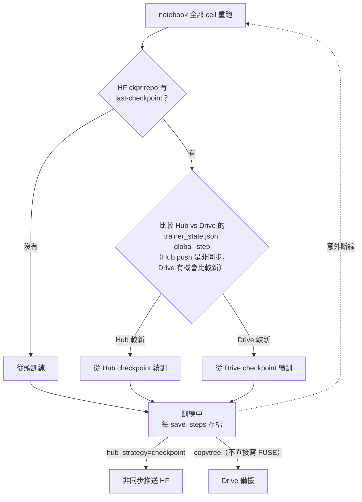
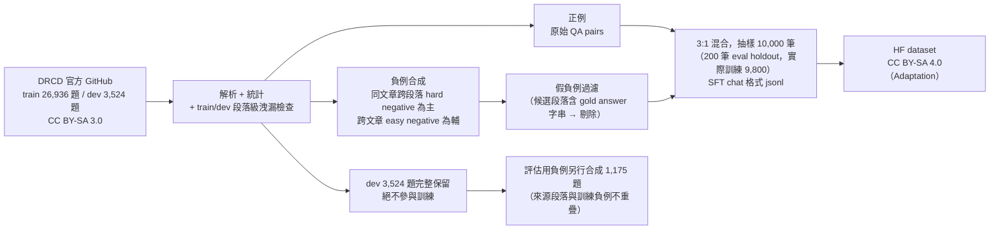
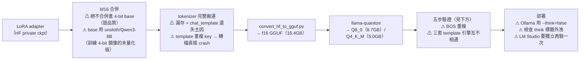
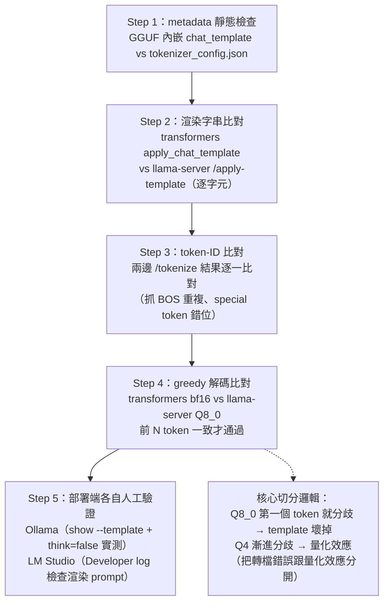

# PLAN.md — 開源模型全生命週期專案：實作藍圖

> **一句話**：把 `Qwen/Qwen3-8B` 用 DRCD 做繁中抽取式 QA 的 QLoRA 微調（Colab），回本機（Win11 + WSL2 + RTX 4090）合併、轉 GGUF、量化、部署到 Ollama / LM Studio，正式發佈到 Hugging Face，並以五組對照實驗回答：**「量化會吃掉多少微調效果？」**
>
> 本文件是全專案的單一事實來源（single source of truth）。實作照此執行；過程中的調整先討論、改這份文件、再動工。
> 事實查證日期：**2026-07-13**（10-agent 研究工作流 + 關鍵授權事實對抗性覆核，一手來源見附錄）。

---

## 0. 環境與分工（嚴格遵守）

| 角色 | 環境 | 職責 |
|------|------|------|
| 訓練 | Colab Pro（$9.99/月、100 CU/月；L4 為主，搶得到 A100 更好） | QLoRA 微調。**Pro 無背景執行**（已查證，Pro+ 才有）→ notebook 必須可斷線續訓 |
| 其他一切 | 本機 Win11 + WSL2 + RTX 4090（24GB） | 資料前處理、合併、轉檔、量化、部署、評估、發佈 |
| 交接 | HF private repo（主）+ Google Drive（備援） | Colab 每 N steps 推 adapter checkpoint；本機從 HF 拉回 |

注意：本機 GPU 可能被其他專案佔用——**每個需要 GPU 的階段開工前先確認 GPU 空閒**。

---

## 1. 已確認決策（2026-07-13 拍板）

1. **基底模型：`Qwen/Qwen3-8B`**（Apache-2.0、不 gated、命名自由）
   - 「要新一點且電腦跑得動」的查證結論：Llama 4 全系列（最小 Scout 109B MoE）、Qwen3.6（僅 27B/35B，27B bf16 ≈ 54GB 超出 4090）、Qwen3.5-9B（多模態 mmproj 拆檔，目前無任何 GGUF 能上 Ollama）全數排除，Qwen3-8B 是符合全部約束的最新版
   - 代價：hybrid thinking template 是 GGUF/Ollama 鏈的經典雷點 → 以三層緩解馴服（§4.1），並轉化為 §7.3
   - 保底備案：`Qwen/Qwen2.5-7B-Instruct`（純 ChatML 零 template 風險；若 Qwen3 template 馴服在 Phase 4 卡死超過預期，回退此模型重訓）
2. **checkpoint 交接：HF private repo 主力**（`hub_strategy="checkpoint"`）**+ Google Drive 備援**（本地存檔後 `copytree`，不直接寫 FUSE 掛載）
3. **文件語言：正體中文（zh-TW）為主，專有名詞直接用原文**（QLoRA、chat template、GGUF……不硬翻）；HF model card 同原則
4. **評估組3（FT 未量化 transformers bf16）：必做**——它是「Q4 吃掉多少微調增益」的關鍵對照組（隔離量化變因的上限基準），五組全跑

---

## 2. 查證事實摘要

### 2.1 Qwen3-8B
- `Qwen/Qwen3-8B`：8.2B dense、Apache-2.0（HF API 驗證 `gated=false`、`license:apache-2.0`）、2025-04 發佈，2026 年中生態成熟
- 衍生發佈義務：僅保留 Apache 授權文；LoRA / GGUF 可自由命名、可商用
- Unsloth 官方 Qwen3 微調教學與 `unsloth/Qwen3-8B` bnb-4bit 預量化 repo 齊備；llama.cpp / Ollama 支援成熟（Ollama 新引擎對 Qwen3 有專用 Go renderer/parser）
- Hybrid thinking：template 內建 `enable_thinking` 分支、預設輸出 `<think>...</think>`、`/think` `/no_think` 軟開關、多輪剝除歷史 thinking

### 2.2 DRCD
- 官方來源：https://github.com/DRCKnowledgeTeam/DRCD （Delta 電子；僅 3 個 JSON + README；最後 commit 2020-04，實質凍結但在線）
- 授權：**CC BY-SA 3.0**（README 明載。HF 鏡像 `voidful/DRCD` card 誤標 CC-BY-3.0，以 GitHub 為準）
- 規模：train **26,936** 題 / dev **3,524** 題 / test ~3,493 題；SQuAD v1.1 格式（`data → paragraphs → qas → answers[{text, answer_start}]`）；dev/test 多參考答案、train 單一
- **原生無 unanswerable 題**（無 `is_impossible`）→ 負例必須自行合成（§4.2）
- 授權影響：
  - 發佈處理過的 SFT dataset = Adaptation → **必須 CC BY-SA 3.0 或 4.0**（不得改 MIT/Apache），須註明修改內容、歸屬 Delta Research Center、引用 arXiv:1806.00920、註明 Wikipedia 上游
  - 模型權重：業界通說 ShareAlike 不傳染到權重（無判例），權重可用 Apache-2.0 發佈，但 model card 必須歸屬 DRCD
  - model card 內引用的資料範例本身屬 BY-SA
- 取用路徑：直接抓官方 GitHub 3 個 JSON（~50MB）自行解析，不依賴 HF 鏡像
- **Phase 1 實測驗證**（`build_dataset.py`）：DRCD 是「段落級」切分而非「文章級」——292 篇 Wikipedia 文章同時貢獻段落給 train 和 dev（`article_id` 重疊），但已逐段落文字比對確認 **train/dev 間段落文字零重疊**（DRCD 官方切分的既有特性，非本專案流程引入的洩漏，hold-out 完整性成立）

### 2.3 TMMLU+（catastrophic forgetting 檢查）
- 官方：`ikala/tmmluplus`（HF）；card 現標 **MIT**（2026-07-13 驗證；早期第三方頁面標 CC BY-NC，文件記錄存取日期即可）
- 22,690 題 / 66 科目 / 4 大類（STEM、社會科學、人文、其他）；欄位 `question / A / B / C / D / answer`
- 抽樣慣例：每科目均勻抽題、報 macro-average accuracy

### 2.4 Colab Pro（$9.99/月）
- 100 CU/月；**無背景執行**；分頁須開著，閒置 ~90 分鐘斷線，session 隨時可能被搶佔
- 費率（社群實測 2026-03，官方不公佈；Colab「Runtime > View resources」可看即時費率）：L4 ≈ **1.71 CU/h**、A100-40G ≈ 5.4、T4 ≈ 1.19；保守預算 ×1.5-2
- **訓練預估（8B QLoRA、~10k 筆、seq 2048、2 epochs、L4）：約 4-6 小時 wall-clock、~10-17 CU**（最壞 ~45 CU）；100 CU 可重跑 2-3 次
- 單一 session 撐不完全程 → 斷線續訓是必要設計，不是加分項

### 2.5 GGUF 轉檔鏈已知陷阱（§7.3 素材，Phase 4 逐條防禦）
1. **絕不合併進 4-bit base**（毀品質；peft#2105）——bf16 重載 base 再 `merge_and_unload()`
2. 合併後**漏存 tokenizer** = chat_template 遺失頭號原因；且要用「訓練輸出」版本的 tokenizer 檔
3. `chat_template.json` 與 `tokenizer_config.json` 內 template 重複 → `convert_hf_to_gguf.py` 直接 crash（unsloth 舊版已知，llama.cpp#7923）
4. BOS 重複：template 帶 BOS + GGUF metadata `add_bos_token=true` → 雙 BOS
5. Ollama **不執行** GGUF 內嵌 jinja——只「模式比對」已知 template，自訂微調 template 比對失敗會**靜默退化成裸 passthrough**（模型看到無角色標記的裸文字）
6. 訓練/服務 template 不一致 → 洩漏 `<|im_end|>`、生成不止
7. LM Studio 用自家 JS jinja 引擎，語法比 transformers 嚴（不吃 `.0` 數字索引、負索引）——llama.cpp 通過不代表 LM Studio 通過

---

## 3. 專案結構

```
專案根/
├── README.md                  # Phase 6：一句話說明 + 五組結果摘要表(置頂) + pipeline 流程圖(mermaid) + quickstart
├── PLAN.md                    # 本文件
├── DESIGN.md                  # Phase 6 定稿：選型理由、負例策略、template 轉檔陷阱（素材隨各 Phase 累積）
├── EVAL_REPORT.md             # Phase 5：五組對比 + W&B 截圖 + Q4 增益損耗專節 + forgetting + 錯誤案例
├── .gitignore
├── configs/
│   └── train_config.yaml      # 超參數單一事實來源（notebook config cell 讀它）
├── data/
│   ├── build_dataset.py       # DRCD 官方 GitHub 下載 → 負例合成 → SFT jsonl → 統計報告
│   ├── raw/                   # DRCD 原始 JSON（gitignore）
│   └── processed/             # SFT jsonl（gitignore；推 HF private dataset，CC BY-SA 4.0）
├── notebooks/
│   └── colab_qlora_train.ipynb  # Unsloth QLoRA + W&B + hub_strategy=checkpoint 斷線續訓
├── scripts/                   # 本機 WSL2 執行
│   ├── 10_download_adapter.py # 從 HF private repo 拉最終 adapter
│   ├── 20_merge_lora.py       # bf16 重載 base + merge_and_unload + tokenizer 完整搬運
│   ├── 30_convert_gguf.sh     # convert_hf_to_gguf.py --outtype f16
│   ├── 31_quantize.sh         # llama-quantize Q8_0 / Q4_K_M
│   ├── 40_verify_template.py  # 五步驗證協定（關鍵交付物）
│   ├── 50_eval_qa.py          # DRCD dev 五組評估（EM/F1/JSON 合法率/unanswerable 準確率）
│   ├── 51_eval_tmmlu.py       # TMMLU+ 200 題 forgetting 檢查
│   └── 60_publish_hf.py       # LoRA repo + GGUF repo 上傳（含 model card）
├── deploy/
│   ├── Modelfile              # Ollama（手寫 Go TEMPLATE，不信任自動偵測）
│   ├── OLLAMA.md
│   └── LMSTUDIO.md
└── results/                   # 評估輸出 json/csv + 圖表（入 git）
```

> **Phase 6 實際調整**：`DESIGN.md` 併入本文件的 §7；另外新增的 `DIAGRAMS.md` 也在 Phase 6
> 尾聲拆散揉進 README.md（總覽圖）、本文件 §4.7/§7（機制與陷阱圖）、EVAL_REPORT.md（評估
> 圖表）——避免圖解自己單獨佔一份文件、跟正文脫節。實際頂層文件只有 4 份：README.md、
> PLAN.md（本文件）、EVAL_REPORT.md。

大檔案（合併後模型、f16 中間檔、GGUF）一律放 WSL2 ext4（如 `~/work/qwen3-drcd/`），**不入 repo、不放 /mnt/c**（9P 慢 3-5 倍）；只把最終 .gguf 複製到 Windows 一次餵 Ollama/LM Studio。

### HF 資產命名（暫定，Phase 6 前可調）
| 資產 | repo id（示意） | 授權 | 可見性 |
|------|----------------|------|--------|
| SFT dataset | `<user>/drcd-zhtw-extractive-qa-sft` | **CC BY-SA 4.0** | 訓練期 private，發佈時轉 public |
| adapter checkpoint（訓練期） | `<user>/qwen3-8b-drcd-qa-ckpt` | — | private（發佈後可刪） |
| LoRA adapter（正式） | `<user>/Qwen3-8B-DRCD-zhTW-QA-LoRA` | Apache-2.0 | Phase 6 轉 public |
| GGUF | `<user>/Qwen3-8B-DRCD-zhTW-QA-GGUF` | Apache-2.0 | Phase 6 轉 public |

---

## 4. 設計決策

### 4.1 Qwen3-8B thinking template 馴服（三層防線）

DRCD 抽取式 QA 不需要推理軌跡，目標是部署端**根本不產生** `<think>` 標籤：

1. **訓練端**：SFT 資料一律以 `tokenizer.apply_chat_template(..., enable_thinking=False)` 渲染（等效於 assistant 回應開頭帶空 `<think>\n\n</think>` 的非 thinking 格式——以 Unsloth Qwen3 官方教學做法為準）。模型學到的格式與出貨 template 完全一致
2. **llama.cpp 端**：llama-server `--jinja`（現已預設開啟）+ `--chat-template-kwargs '{"enable_thinking":false}'`；§4.4 五步驗證協定全部以 `enable_thinking=false` 渲染為基準
3. **Ollama / LM Studio 端**：Ollama 新引擎對 Qwen3 走內建 Go renderer，**可能忽略 Modelfile 自訂 TEMPLATE**（ollama#14560）→ 以 `ollama run --think=false` / API `think` 參數控制，並用 `OLLAMA_DEBUG=1` 檢視實際渲染的 prompt 實測確認；LM Studio 在 Prompt Template 覆寫區處理

已知症狀對照表（入 §7.3）：微調無 thinking 軌跡 + 保留原 template → 永不閉合的 `<think>`、空 think 前綴污染 JSON 解析。評估腳本防禦性 strip think 標籤再 parse，但**驗收標準是部署端零 think 標籤**。

### 4.2 unanswerable 負例合成（DRCD 原生沒有）

| 策略 | 難度 | 額度 |
|------|------|------|
| **同文章跨段落配對**（主力）：問題配上同一篇 Wikipedia 文章的其他段落——詞彙高度重疊但答案不在 | hard | 負例的 ≥70-80% |
| 跨文章隨機配對（防捷徑）：防止模型學到「低詞彙重疊 = 拒答」 | easy | 負例的 <20-30% |

- **假負例過濾（必做）**：gold answer 字串恰好出現在替換段落 → 剔除（字串比對；抽樣人工複查）
- 比例：answerable : unanswerable ≈ **3:1**（SQuAD 2.0 慣例區間 2:1~3:1）
- 拒答目標輸出固定：`{"answer": "", "answerable": false}`（方便 EM 計分）
- train 抽 **8k-12k 筆（含負例）**；**dev 3,524 題完整保留 hold-out、絕不參與訓練**；評估用負例另從 dev 以同策略合成（來源段落與訓練負例不重疊）

### 4.3 SFT 格式（草案，Phase 1 定稿）

```
[system] 你是精確的閱讀理解助手。根據「文章」回答「問題」：
- 答案必須是文章中的連續原文片段，一字不改
- 若文章中找不到答案，answer 填空字串、answerable 填 false
- 只輸出 JSON：{"answer": "...", "answerable": true|false}

[user] 文章：{context}

問題：{question}

[assistant] {"answer": "文中片段", "answerable": true}
```

- JSON 以 `ensure_ascii=False` 序列化（可讀性 + token 效率）
- 五組評估共用同一 system prompt；組2（few-shot）在 user 訊息前多插 3 個固定範例（2 正 1 負）
- 渲染一律 `enable_thinking=False`（§4.1）

### 4.4 Chat template 驗證五步協定（`40_verify_template.py`，關鍵交付物）

1. **metadata 靜態檢查**：`gguf_dump` 讀 GGUF 內嵌 `tokenizer.chat_template` / `add_bos_token` / EOS-EOG ids，diff 訓練 checkpoint 的 `tokenizer_config.json`
2. **渲染字串比對**：transformers `apply_chat_template(tokenize=False, add_generation_prompt=True)` vs llama-server **`/apply-template`** 逐 byte diff
3. **token-ID 級比對**：transformers `apply_chat_template(tokenize=True)` vs llama-server `/tokenize`（`add_special` 開/關各跑一次）——抓 BOS 重複、special token 錯位
4. **greedy 解碼比對**：同 20-50 題 DRCD dev，transformers bf16 vs llama-server **Q8_0**（temperature 0）比對前 ~100 tokens。**Q8_0 從第一個 token 就分歧 = template 壞掉；Q4 漸進分歧 = 量化效應**——這個切分邏輯就是本專案核心方法論
5. **Ollama / LM Studio 各自獨立驗證**：Ollama 用 `ollama show --template` + `OLLAMA_DEBUG=1` 看實際渲染 prompt；LM Studio 看開發者日誌。llama.cpp 通過**不代表**這兩者通過（三套 template 引擎）

### 4.5 五組評估設計（`50_eval_qa.py`）

| # | 組別 | 權重 | 執行端 | 意義 |
|---|------|------|--------|------|
| 1 | base zero-shot | Qwen3-8B 原廠 | transformers bf16 | 下限基準 |
| 2 | base few-shot（3-shot） | Qwen3-8B 原廠 | transformers bf16 | 「微調 vs prompting」對照 |
| 3 | FT 未量化 | 合併後 bf16 | transformers bf16 | **微調增益上限（隔離量化變因）** |
| 4 | FT Q8_0 | GGUF | llama-server | 轉檔損耗探針（近無損） |
| 5 | FT Q4_K_M | GGUF | llama-server | 部署實態 |

- 指標：**字元級 EM / F1**（CMRC 2018 mixed-segmentation 慣例：中文按字、英數整詞；dev 多參考答案取 max）、**JSON 合法率**、**unanswerable 準確率**
- **不可**直接用 SQuAD `evaluate-v1.1.py`（空白斷詞在中文會壞）
- 核心答案：**「Q4 吃掉多少微調增益」=（組3−組1）vs（組5−組1）**；組4 切分損耗來自「轉檔」還是「Q8→Q4」
- 組4/5 走 llama-server OpenAI 相容 API + async client（continuous batching，`-np 8`；context 總量 = 槽數 × 單請求 context，`-c` 要配好）；**不用 llama-cpp-python**（同步慢 + 自帶 chat-format 層會重新引入 template 漂移）
- 所有組別 temperature 0、固定 seed；報告記錄 llama.cpp build commit
- Forgetting：TMMLU+ 66 科抽樣共 200 題，**base vs FT 同在 transformers bf16** 下比（隔離微調單一變因），報 macro accuracy 變化

### 4.6 訓練超參數（草案 → `configs/train_config.yaml`，Phase 2 定稿）

| 項目 | 值（草案） | 備註 |
|------|-----------|------|
| 基底 | `unsloth/Qwen3-8B`（bnb-4bit 預量化鏡像） | 下載快、不吃 HF gate |
| LoRA | r=16, alpha=16, dropout=0 | target: q,k,v,o,gate,up,down 全線性層 |
| max_seq_length | 2048 | DRCD context 多在 500-1000 字，含 prompt 足夠；超長樣本截斷策略 Phase 1 統計後定 |
| batch | per_device 2-4 × grad_accum 4-8（有效 16） | L4 24GB、4-bit 下 ~14-16GB |
| lr / schedule | 2e-4 / cosine, warmup 3% | QLoRA 慣例區間 |
| epochs | 2（sanity 後可調） | |
| optimizer | adamw_8bit | |
| 精度 | bf16（L4 支援） | |
| 記錄 | W&B（loss / lr / grad_norm；project: `qwen3-drcd-qlora`） | |
| checkpoint | save_steps ≈ 15-30 分鐘一存；`hub_strategy="checkpoint"`; `save_total_limit=2` | |

### 4.7 Colab notebook 斷線續訓設計（`colab_qlora_train.ipynb`）

Cell 結構：**config（讀 yaml）→ 自動安裝 → HF 登入（Colab Secrets 存 write-scope token）→ 拉資料 → 建模 → 「續訓偵測」→ 訓練 → 收尾**

- 開訓前 **fail-fast 檢查**：`create_repo(private=True)` 冪等建 repo → 手動 `upload_file` 煙霧測試（write scope 驗證，token 錯在第 0 步就炸，不是訓 2 小時後）
- 續訓偵測 cell：`snapshot_download(ckpt_repo, allow_patterns="last-checkpoint/*")` 有東西 → `trainer.train(resume_from_checkpoint=...)`；沒有 → 從頭訓。**同一顆 notebook 跑到底，斷線後重跑全部 cell 即自動續訓**
- 已知陷阱防禦：push 是非同步（斷線可能丟最後一個間隔，save_steps 據此取密一點）；`hub_private_repo` 對已存在 repo 無效（所以先 `create_repo`）；Unsloth 續訓靠 Trainer checkpoint（**不是** `save_pretrained_merged`）；Drive 備援 = 本地存檔後 `shutil.copytree`（不直接把 output_dir 指到 FUSE）
- 先 200 筆 sanity check（Phase 2）：含一次**人為 kill-resume 演練**驗證續訓真的能用



Phase 3 實戰驗證：使用者不慎關閉整個瀏覽器（非演練），重連後正確偵測到 global_step=1226
（訓練已在斷線前跑完），零資料損失——見 Phase 3 實作紀錄。

---

## 5. 階段拆分與驗收標準（每階段完成→停下等確認）

### Phase 0：藍圖與骨架（本次）
- 產出：本 PLAN.md + 目錄骨架 + .gitignore
- 驗收：結構與 §3 一致；PLAN.md 無遺留 TBD

### Phase 1：資料前處理（`data/build_dataset.py`；無 GPU 需求）
- 下載官方 DRCD 3 JSON（快取到 `data/raw/`）→ 解析統計（題數、context 長度分佈、token 長度分佈）→ 負例合成（§4.2）→ SFT jsonl（§4.3）→ train 抽樣 8k-12k → 統計報告（stdout + `results/data_stats.json`）
- 推 HF private dataset（CC BY-SA 4.0 card：Delta 歸屬 + arXiv 引用 + 修改聲明 + Wikipedia 上游）
- 驗收：統計數字合理（題數對上 §2.2）；抽樣人檢 20 筆（含正負例）；假負例過濾抽檢通過；dev 完整 3,524 題未被動過
- §7.2 素材：負例策略章節初稿

### Phase 2：Colab sanity check（200 筆）✅ 完成（含一項已知缺口，見下）
- notebook 完成（§4.7 全部設計）；200 筆訓練 loss 明顯下降；checkpoint 出現在 HF private repo；W&B 曲線正常
- 跑之前回報：實測費率、預估全量時數與 CU
- **驗收結果**：
  - 200 筆訓練：validation loss 0.13 → 0.03 穩定收斂 ✅
  - chat template 正確性：自動斷言（空 think block）+ 人工核對渲染文字皆通過 ✅
  - checkpoint 完整性：直接用 HF API 驗證 `last-checkpoint/` 內 `trainer_state.json`／`optimizer.pt`／`scheduler.pt` 等續訓所需檔案齊全 ✅
  - **session 級續訓**：連續兩次獨立驗證通過——重開 Colab session 後正確從既有 Hub checkpoint 接續訓練（39→接著訓到 130；130→接著訓到 195），且都精準接在 `save_steps` 存檔邊界上，不是從頭開始 ✅
  - **訓練「進行中」手動中斷**：三次嘗試皆未成功抓準 GUI 操作時機（訓練跑得比預期快、Restart 確認對話框誤按取消），未直接觀測到。但存檔機制本身（`hub_strategy="checkpoint"`，每 5 步即時寫入+推送）已確認在訓練過程中持續正確運作（log 可見 `[drive-backup]` 訊息即時輸出），且上述兩次 session 級續訓已涵蓋續訓邏輯的核心路徑。**判定：現有證據強度足以支撐進入 Phase 3，此缺口不阻塞後續進度，但誠實記錄**——真正的訓練中斷是不可控時機點，Phase 3 全量訓練若真的中途斷線，會是這個機制的第一次「未經人工排練」的實戰驗證
- 過程中額外意外發現：查證 HF Hub `raw/<branch>/...` 端點存在邊緣 CDN 快取過期問題（本機查詢一度顯示遠舊於實際的 checkpoint 狀態，用明確 commit hash 查證後確認底層資料完全正確）——純屬查詢端議題，不影響 Colab 訓練/推送本身
- **實作紀錄**：`notebooks/colab_qlora_train.ipynb` + `configs/train_config.yaml` 已完成，經對抗性覆核（API 正確性 + 邏輯/邊界情況兩路）修正兩個真問題：
  (1) Google Drive 備援目錄原本 sanity_check/full_run 共用，會導致切換 mode 後誤續訓錯誤的 checkpoint——已改成依 mode 分子目錄；
  (2) 續訓來源原本「Hub 有就無條件用 Hub」，但 Hub 推送是非同步的，斷線時機不巧 Drive 可能比 Hub 新——已改成比較兩邊 `trainer_state.json` 的 `global_step` 取較新者。
  另有一項覆核回報的「blocker」（qwen3 template 不會自動補空 think block）經直接讀 unsloth/chat_templates.py 原始碼手動逐行驗證後確認是誤報，§4.1 的機制設計成立、未變更。
  - **實測踩雷**：使用者在 Colab 實跑時撞到 `AttributeError: 'NoneType' object has no attribute 'endswith'`（模型載入 cell）。三路查證直接讀 Unsloth 原始碼確認根因：`from_pretrained` 被 `_offline_aware_load` 包住，線上載入撞到任何「網路相關」例外會靜默重試一次、強制 `local_files_only=True`；Colab 上 `hf_transfer` 快速下載大型 safetensors 常不穩，觸發這個重試後離線模式在快取不完整時找不到檔案，`transformers` 不會丟出清楚錯誤而是讓 `checkpoint_files` 變成 `None`。**先前「清快取重試」的修法是反效果**（保證離線重試那次一定找不到檔案）。正確修法：關掉 `HF_HUB_ENABLE_HF_TRANSFER`、用 `snapshot_download` 穩定版下載器預先把模型下載完整，已寫入 notebook cell 7。
  - **實測踩雷（第二回合）**：套上一版修法後改卡在 `snapshot_download` 本身，大型 safetensors 停在 0% 不動。三路查證確認真正元凶是 `hf_xet`（huggingface_hub 新版預設的高速傳輸元件，取代舊版 `hf_transfer`，`HF_HUB_ENABLE_HF_TRANSFER` 對它沒有作用），在 Colab 網路環境會卡死在 0%——GitHub 上有多筆 2026 年的相同回報，其中一筆就是 Colab。查證也發現官方文件的 `HF_HUB_DISABLE_XET=1` 環境變數本身不保證生效（huggingface_hub#3266），保險做法是連 `hf_xet` 套件都移除。已改為：notebook 開頭第一格立刻設 `HF_HUB_DISABLE_XET=1`（必須在 huggingface_hub 被 import 之前生效，若接續已 import 過的 session 要先 Restart session）+ 安裝 cell 最後 `pip uninstall -y hf_xet` 雙重保險。
  - **實測踩雷（第三回合）**：關掉 `hf_xet` 後大型權重檔（7.5GB）成功下載，但單一小檔案（`tokenizer.json`）撞到 `403 SignatureError: invalid key pair id`——查證確認這是 **HF 官方 Xet CDN 基礎設施當下異常**（huggingface/datasets#8328，2026-07-13/14 開的 issue，環境與時間點完全吻合），不是我們設定問題，性質是間歇性的。`snapshot_download` 本身可續傳，已寫入重試迴圈（`MAX_DOWNLOAD_RETRIES=5`，遞增等待），已下載完成的大檔案不會重抓。
  - **實測踩雷（第四回合）**：重試迴圈成功下載全部檔案後，`from_pretrained` 卻直接卡在離線模式報 `OSError: couldn't connect... local_files_only`，即使本地快取已經齊全。第一版猜測是環境變數殘留污染，Restart session + 防禦性 `os.environ.pop` 後**同樣的錯誤還是重現**，回頭核對第一次（全新 session、尚未套任何修法）的原始錯誤紀錄，發現 `_force_hf_offline` 從第一次呼叫就已經觸發——排除污染累積說。直接讀 `_get_effective_local_files_only` 原始碼確認它只吃兩個訊號（`local_files_only` kwarg 或 `HF_HUB_OFFLINE`/`TRANSFORMERS_OFFLINE` 環境變數），且 `tokenizer_name` 已確認預設等於 `model_name`（同一個 repo，非解析到不同 repo）。真正原因未完全查清（懷疑跟 `snapshot_download` 不指定 `revision` 時 transformers 在離線模式下解析 `main` 對應快取資料夾的機制沒對齊），改採更穩妥、不依賴猜對根因的修法：呼叫 Unsloth 前先用 transformers 原生 `AutoConfig`/`AutoTokenizer` 自己成功呼叫一次（正常線上流程），把快取用標準機制寫好，讓 Unsloth 之後不管線上或離線都能正確找到。此修法確認有效——模型載入 cell 之後順利通過。
  - **實測踩雷（第五回合）**：模型載入過關後，下一步載入 Phase 1 推送的 HF dataset（`load_dataset`）又撞到同一種 `xet-bridge` 簽章錯誤——連自己的小 dataset repo 都中，確認第三回合的判斷（HF 全站 Xet 基礎設施當下不穩）成立，不是特定 repo 的問題。這個下載呼叫原本沒包重試邏輯，已比照第三回合補上相同的重試迴圈。

### Phase 3：全量訓練 ✅ 完成
- 8k-12k 筆、2 epochs、W&B 全程記錄；斷線就續訓
- 驗收：train/eval loss 收斂曲線合理；最終 adapter 在 HF private repo；實際 CU 消耗記錄入 EVAL_REPORT.md 素材
- **驗收結果**（2026-07-15）：
  - 1,226 步、2 epochs 全部跑完；最終 adapter 完整推送至 `steven0226/qwen3-8b-drcd-qa-ckpt`（private，檔案齊全，API 驗證通過）
  - training loss：step 100 的 0.032 → step 1200 的 0.005，穩定下降
  - validation loss：step 50 的 0.029 快速降至 step 600 附近的 ~0.0175，之後穩定在 0.017-0.018 微幅震盪、無過擬合反彈——收斂曲線健康，比 Phase 2 的 200 筆 sanity check 更具參考價值（真實全量資料規模）
  - W&B run：https://wandb.ai/tunyu1/qwen3-drcd-qlora/runs/e8h2wq6x
  - **真實斷線續訓實戰驗證**：訓練途中使用者不慎關閉整個瀏覽器（非刻意演練），重新連線後「續訓偵測」正確抓到 `global_step=1226`（訓練其實已在斷線前跑完全部步數），資料零損失——這正是 Phase 2 排練三次都沒排練成功的「真實中斷」情境，這次在正式環境下自然發生並驗證機制確實可靠
  - CU 實際消耗：**不記錄**——訓練途中意外斷線重連，且無法確認同一帳號同時段是否有其他專案並行消耗 CU，數字會失真，EVAL_REPORT.md 改用 §2.4 的預估值（約 8-12 CU）加註「未取得乾淨的實測值」即可，不影響其他驗收項目
- **時數/CU 預估**（2026-07-14，用 Phase 2 sanity check 實測吞吐量校準）：訓練資料 9,800 筆（10,000 扣 200 eval_holdout）、
  effective batch 16、2 epochs ≈ 1,226 步；實測 L4 steady-state ≈ 11.8 秒/步 → 純訓練 ≈ 4.0 小時 + eval 開銷（每 50 步、
  200 筆 eval，約 24 次）≈ 0.36 小時 → **總計約 4.4 小時**，與原查證估計「4-6 小時」吻合（落在樂觀端）。
  CU：4.4h × 1.71 CU/h（L4 實測費率）≈ 7.5 CU，抓寬鬆保守區間 **8-12 CU**（原估 10-17 CU，這次估得更精準）。
  使用者已確認此預算，100 CU/月配額內綽綽有餘。
- **啟動方式**：notebook 內建預設值已改為 `mode: "full_run"`（不用再手動編輯 GUI 找那行改，Phase 2 除錯階段
  多次卡在手動編輯／GUI 操作時機，這次直接把正確設定寫進檔案本身），`configs/train_config.yaml` 同步更新。
  Phase 2 踩過的五輪坑（hf_xet、離線模式判斷、xet-bridge 簽章錯誤重試、tokenizer 預先解析）全部已固化進
  notebook，全量訓練沿用同一份 notebook、同一套防禦機制。

### Phase 4：本機合併/轉檔/量化/部署 + template 驗證（重頭戲；需 GPU，開工前確認 4090 空閒）
- WSL2 環境：llama.cpp CUDA build（`-DGGML_CUDA=ON -DCMAKE_CUDA_ARCHITECTURES=89`；裝 `libcurl4-openssl-dev`；WSL 記憶體上限確認 ≥20GB，必要時調 `.wslconfig`）
- `10_download` → `20_merge`（bf16 重載 base、merge、**tokenizer 完整搬運**、檢查 template 重複檔）→ `30_convert`（f16）→ `31_quantize`（Q8_0 / Q4_K_M）
- `40_verify_template.py` 五步協定（§4.4）全綠
- 部署：GGUF 複製到 Windows → Ollama（Windows 原生；手寫 Modelfile Go TEMPLATE + `think=false` 驗證）→ LM Studio（`lms import` 或兩層目錄）→ 兩端手動對話測試
- **實作紀錄**（2026-07-15）：
  - WSL2 環境是共用的（`Ubuntu-bench` 發行版裡還有 `gguf-factory`、`llm-bench`、`local-llm-mcp` 等其他專案），為避免互相干擾，本專案用獨立資料夾 `~/qwen3-drcd-gguf/`，不動其他專案的東西
  - 原本 WSL2 只分配到 ~15GB RAM（host 實體 RAM 約 32GB，WSL2 預設拿 50%），bf16 合併 8B 模型需要的量不夠，已建立 `.wslconfig` 拉高到 24GB（系統層級設定，動之前先問過使用者）
  - CUDA Toolkit 13.1 已預先裝好（其他專案留下的），`CMAKE_CUDA_ARCHITECTURES=89` 對應 RTX 4090 compute capability 8.9
  - 合併 base model 選擇：PEFT 記錄的 `base_model_name_or_path` 是 `unsloth/Qwen3-8B-unsloth-bnb-4bit`（4-bit 版），合併改用它背後對應的**未量化版本** `unsloth/Qwen3-8B`（同團隊、同樣 tokenizer 修正，只是沒有量化），避免解量化損失
  - 合併乾淨完成，無 chat_template 重複 key 問題（腳本有自動偵測+修復機制，這次沒觸發到）
  - **五步驗證協定（§4.4）全數自動化步驟（Step 1-4）全綠**：GGUF metadata 與 tokenizer_config 的 chat_template 完全一致（4718 字元逐字對應）；5 個真實 DRCD dev 範例的渲染字串、token-ID、greedy 解碼（transformers bf16 vs llama-server Q8_0）全部一致——證明轉檔沒有破壞 template，Q8_0 量化在這些範例上跟未量化版行為相同
  - 已知坑：`llama-server` 載入 8.2GB Q8_0 模型需要約 60 秒（略久於一般預期），驗證腳本的健康檢查逾時要抓足夠寬（原本設 60 秒卡在邊界，已拉到 180 秒）；且第一次跑撞到殘留的 `llama-server` 行程佔用 port，之後腳本改成不把 server 的 stdout/stderr 導向 DEVNULL（改寫到獨立 log 檔），方便下次除錯
  - GGUF 檔案從 WSL2 複製到 `D:\models\qwen3-8b-drcd-qa\` 經過 9P 橋接，13GB 花了約十分鐘（`D+` disk-sleep 狀態，非卡死，Windows 端 `Get-ChildItem` 中途讀到的檔案大小會停在 0（中繼資料尚未刷新），要用 WSL 端 `ps aux` 確認行程真的活著比較準）
  - **部署結果與原計畫不同**：原計畫是「手寫 Modelfile Go TEMPLATE」，但實測 Ollama 新版引擎（`ollama show --template`）直接讀出 GGUF 內嵌的**原生 jinja template**（不是退化成 Go template 比對），內容跟 transformers 端驗證過的 chat_template 一致，包含 `enable_thinking is false` 時插入空 `<think>\n\n</think>\n\n` 的邏輯。所以 Modelfile 最終**沒有**手寫 TEMPLATE，只靠自動偵測，`ollama run --think=false` 實測輸出乾淨 `{"answer": "1807年", "answerable": true}`，無需 fallback
  - LM Studio：`lms import --copy`（互動確認用 `echo Y |` 帶過，非互動環境）匯入 Q4_K_M，`lms load` + 本地 OpenAI-compatible API（`localhost:1234/v1/chat/completions`）送同一測試案例，回應 `reasoning_content` 為空字串、`content` 為乾淨 JSON，同樣無需修改內嵌 template
  - 測試完成後 `lms unload` 釋放 GPU；Ollama 模型有自己的 idle 逾時（預設幾分鐘後自動卸載），未手動介入
- 驗收：五步全綠；Ollama 與 LM Studio 各自輸出正常 JSON、零 `<think>` 洩漏（皆已實測確認）；OLLAMA.md / LMSTUDIO.md 完稿 ✅ **Phase 4 完成**
- §7.3 素材：template 陷阱實錄（實際踩到什麼、怎麼修）

### Phase 5：五組評估 + forgetting（需 GPU）✅ 完成
- `50_eval_qa.py` 五組全跑（§4.5）+ `51_eval_tmmlu.py`（200 題 ×2 權重）
- 產出 EVAL_REPORT.md：五組對比表、W&B 截圖、「Q4 吃掉多少微調增益」專節、forgetting 分析、≥5 個錯誤案例分析（含 answerable 誤判方向分析）
- 驗收：結果表完整、核心問題有量化答案、結論與數據自洽
- **驗收結果（2026-07-17）**：`EVAL_REPORT.md` 已完稿。核心問題答案：微調增益（組3−組1）EM
  +0.4569，Q4 部署後（組5−組1）EM +0.4574——量化幾乎零損耗。TMMLU+ forgetting check 確認
  macro accuracy 掉 12.25 個百分點，微調本身的副作用遠大於量化。5 個錯誤案例（JSON 格式失敗、
  抽取不精確、answerable 誤判兩個方向、TMMLU+ 具體科目失分）+ answerable 誤判方向統計（幻覺
  15 題 vs 過度拒答 17 題，方向均衡無系統性偏誤）+ W&B train/eval loss 截圖，均已納入報告。
- **實作紀錄（2026-07-16，進行中——本節為當機保險用的進度快照）**：
  - `scripts/50_eval_qa.py` 已完成並經單元測試（EM/F1 計分、JSON 解析、分層抽樣）＋三引擎 pilot 實測通過（transformers 批次、llama-server Q8_0、llama-server Q4_K_M 各 20 題）。設計重點：CMRC2018 風格字元級 EM/F1（中文逐字、英數整詞、多參考答案取 max）；JSON 解析失敗計 EM=F1=0 並單獨統計合法率；**斷點續跑**（逐題落盤 `results/eval_raw/<group>.jsonl`，重跑自動跳過已完成 qid）；base 組用 `unsloth/Qwen3-8B`（跟合併時同一顆 base，隔離微調變因）；組4/5 走 llama-server `-np 8` continuous batching + ThreadPoolExecutor 並發（不用 llama-cpp-python）
  - `scripts/51_eval_tmmlu.py` 已完成並測試抽樣邏輯（datasets-server REST API 直抓，66 科目均勻抽樣、抽樣快取確保 base/FT 同題可比），**推論還沒跑**（tmmlu_sample.json 快取尚未建立）
  - 使用者確認：DRCD dev 用完整 4699 題（3524 answerable + 1175 unanswerable），不抽樣
  - **五組進度（存於 `results/eval_raw/*.jsonl`，逐題落盤、當機不丟）**：
    | 組別 | 進度 | 期中結果 |
    |------|------|----------|
    | base_zeroshot | ✅ 4699/4699 | EM 0.4756 / F1 0.6858 / JSON 合法率 0.956 |
    | base_fewshot | ✅ 4699/4699（bug 修復後乾淨重跑） | EM 0.8253 / F1 0.9191 / JSON 合法率 0.9998 |
    | ft_unquantized | ✅ 4699/4699 | EM 0.9325 / F1 0.9704 / JSON 合法率 1.000 |
    | ft_q8 | ✅ 4699/4699 | EM 0.9328 / F1 0.9706 / JSON 合法率 1.000 |
    | ft_q4 | ✅ 4699/4699 | EM 0.9330 / F1 0.9700 / JSON 合法率 1.000 |

  **五組全數完成（2026-07-17）。核心問題初步答案**：微調增益（組3−組1）= 0.4569 EM；
  Q4 部署後的增益（組5−組1）= 0.4574 EM——**量化幾乎沒吃掉微調效果**，Q8/Q4/未量化三組
  數字幾乎重疊在雜訊範圍內。Few-shot（組2）比 zero-shot 大幅提升（+0.35 EM）但仍明顯輸給
  微調（組3，再 +0.11 EM）。舊的 `base_fewshot.jsonl.discarded-20260716`（bug 期間跑的
  1488 題部分結果）保留供對照，不進最終報告。

  - **TMMLU+ forgetting check 完成（2026-07-17）**：`results/eval_raw/tmmlu_base.jsonl` /
    `tmmlu_ft.jsonl` 各 200 題（66 科目均勻抽樣）。**base macro accuracy 0.6301 → FT
    macro accuracy 0.5076，掉了 12.25 個百分點**——確認有明顯的 catastrophic forgetting：
    DRCD QLoRA 微調（2 epochs、train loss 收斂到 0.005）在把模型訓練成「精確抽取式 QA
    機器」的同時，明顯犧牲了原本的通用知識/選擇題能力。抽查 `tmmlu_ft.jsonl` 前幾筆輸出
    確認是乾淨的單一字母作答（無空值、無解析失敗），排除是效能異常造成的假象——
    **這是真實效應，不是 bug**，會是 EVAL_REPORT.md 的重點討論之一（跟 Q4 幾乎零損耗
    形成對比：微調本身的副作用遠大於量化的副作用）
  - **踩雷（已修）：`datasets-server.huggingface.co` rate limit**——66 科目連續打
    request 撞到 HF 公開查詢 API 的滾動配額（觀察到約跑 60 幾科後才開始連續 429，不是
    針對特定科目封鎖）。修法三層：(1) 探測+抓題合併成一次呼叫（少打一半請求）、
    (2) 科目間隔 1.5s、指數退避 cap 60s／10 次重試、(3) 逐科目落盤
    （`tmmlu_sample.progress.jsonl`），失敗重跑只需補剩下科目
  - **踩雷（已修，同一種病，第二次發作）：`51_eval_tmmlu.py` 原本沒設
    `PYTORCH_CUDA_ALLOC_CONF=expandable_segments:True`（`50_eval_qa.py` 修 base_fewshot
    時加的），導致同一 process 內連續載入 base、FT 兩顆模型時，第二顆（`tmmlu_ft`）的
    生成速度掉到 0.03-0.07 題/秒（正常應該 10+ 題/秒），耗時暴增但**運算結果本身沒受
    影響**（已驗證，浮點運算跟顯存怎麼搬無關）。已補上同樣的環境變數 + 定期
    `torch.cuda.empty_cache()`，資料本身不需要重跑（已完整）
  - **踩雷（已修）**：組別執行順序原本用 Python `set` 決定，疊代順序不保證（受字串 hash 隨機化影響），已改為固定 list
  - **踩雷（已修復並驗證，2026-07-16）**：`base_fewshot` 組 transformers 批次生成異常慢——隔離診斷（16 題/batch 直接對比）確認：zero-shot 0.29s/題 vs few-shot 10.9s/題（37 倍慢），且同樣的 batch 重複跑會持續惡化（174s → 292s），生成長度反而更短（14.8 vs 17.4 tokens）、attention 是正常的 sdpa。**根因：固定 batch=16 對 few-shot 長 prompt（~1500-1900 tokens）的 KV cache 需求把 24GB 顯存撐爆（模型 bf16 ~16GB + KV ~5GB + 其他），觸發 Windows WDDM 的 sysmem fallback（顯存溢到系統 RAM）**——症狀特徵是「GPU 使用率 100% 但功耗只有 ~92W」（SM 都在等記憶體搬運）。修法（三管齊下）：(1) 改成 token 預算制動態 batch（`(prompt+max_new_tokens)×batch ≤ 12288`，短 prompt 維持大 batch、長 prompt 自動縮小到 6-7）；(2) prompt 依 token 長度排序組 batch 減少 padding 浪費；(3) `PYTORCH_CUDA_ALLOC_CONF=expandable_segments:True` + 每 8 個 batch `empty_cache()` 抑制碎片化。**驗證（96 題 pilot）：2.18 題/秒穩定（比修前快 ~50 倍，甚至比 zero-shot 組當時的 1.4 題/秒還快），跑 16 個 batch 速度無衰退，JSON 合法率 100%**。全量 4699 題預估 ~36 分鐘
  - **當機後續跑指令**（WSL2 `Ubuntu-bench`，venv `~/qwen3-drcd-gguf/.venv`，於專案根目錄）：
    ```bash
    python3 scripts/50_eval_qa.py --groups all \
      --dev-answerable data/processed/dev_answerable.jsonl \
      --dev-unanswerable data/processed/dev_unanswerable.jsonl \
      --few-shot-examples data/processed/few_shot_examples.json \
      --base-model unsloth/Qwen3-8B \
      --merged-dir /home/tun2404/qwen3-drcd-gguf/work/merged \
      --gguf-q8 /home/tun2404/qwen3-drcd-gguf/work/gguf/qwen3-8b-drcd-qa-Q8_0.gguf \
      --gguf-q4 /home/tun2404/qwen3-drcd-gguf/work/gguf/qwen3-8b-drcd-qa-Q4_K_M.gguf \
      --llama-server-bin /home/tun2404/qwen3-drcd-gguf/llama.cpp/build/bin/llama-server \
      --out-dir results/eval_raw
    # 彙整（不重新推論）：--summarize --out-dir results/eval_raw
    # TMMLU+：python3 scripts/51_eval_tmmlu.py --base-model unsloth/Qwen3-8B \
    #   --merged-dir /home/tun2404/qwen3-drcd-gguf/work/merged --out-dir results/eval_raw
    ```

### Phase 6：HF 發佈 + 文件定稿 ✅ 完成
- `60_publish_hf.py`：LoRA repo + GGUF repo 轉正（完整 card：訓練細節、評估數據、用法（transformers / llama.cpp / Ollama / LM Studio）、Apache-2.0 權重授權、DRCD CC BY-SA 歸屬與引用、基底模型歸屬）；SFT dataset 轉 public（CC BY-SA 4.0）
- README.md（五組結果摘要表置頂 + mermaid 流程圖 + quickstart）、DESIGN.md 定稿
- 驗收：兩個 HF repo 可公開存取、card 授權聲明完整；README 表格數字與 EVAL_REPORT 一致
- **驗收結果（2026-07-18）**：三個資產全數發佈並確認 public：
  [LoRA](https://huggingface.co/steven0226/Qwen3-8B-DRCD-zhTW-QA-LoRA)、
  [GGUF](https://huggingface.co/steven0226/Qwen3-8B-DRCD-zhTW-QA-GGUF)（Q8_0 + Q4_K_M，
  以 HF API 逐一驗證 `private=False` 且檔案清單正確）、
  [dataset](https://huggingface.co/datasets/steven0226/drcd-zhtw-extractive-qa-sft)（訓練期
  private → 轉 public）。README.md / DESIGN.md 皆已完稿，訓練期用的
  private checkpoint repo（`qwen3-8b-drcd-qa-ckpt`、`-ckpt-sanity`）維持不動（未刪除，
  PLAN.md 原文標記「可刪」為選用，非必要動作，交由使用者自行決定是否清理）。
- **文件整合（2026-07-18）**：使用者反饋頂層 .md 檔太多，把獨立的 `DESIGN.md` 併回本文件
  §7、把新增的 `DIAGRAMS.md`（7 張 mermaid 圖）拆散揉進 README.md / 本文件 / EVAL_REPORT.md
  對應章節。最終保留 3 份頂層文件：README.md、PLAN.md、EVAL_REPORT.md。

---

## 6. 風險與備案

| 風險 | 影響 | 備案 |
|------|------|------|
| Qwen3 thinking template 在 Ollama renderer 端馴服失敗 | Phase 4 卡關 | 先試 template 剝除 thinking 分支重打包；仍不行 → 回退 `Qwen2.5-7B-Instruct` 重訓（pipeline 全部共用，僅換 base + template 基準） |
| Colab 搶不到 L4 | 訓練變慢 | T4 也能跑（時間 ×2，CU 反而略省）；搶到 A100 則更快（CU ×3，總消耗接近） |
| CU 爆預算 | 訓練中斷 | 費率即時監控；sanity check 後重估；必要時 pay-as-you-go 加購 $9.99/100CU |
| DRCD GitHub 失聯 | Phase 1 卡關 | 第一時間快取到 `data/raw/` 並備份 Drive；HF 鏡像 `voidful/DRCD` 當備援來源 |
| 4090 被其他專案佔用 | Phase 4/5 延後 | 各 GPU 階段開工前確認；評估腳本支援斷點續跑（結果逐題落盤） |
| 評估 JSON 解析失敗率高 | 指標失真 | JSON 合法率本身就是指標之一；解析失敗計為 EM=F1=0 並單獨統計，錯誤案例入報告 |

---

## 7. 設計理由與踩雷完整敘事

> 原本規劃成獨立的 DESIGN.md，Phase 6 決定併回本文件（避免同一件事在兩份文件各講一半）。
> 這裡是整理過的敘事版本；逐步除錯的時間軸細節仍在第 5 節各 Phase 的「實作紀錄」。

### 7.1 選型理由

#### 基底模型：`Qwen/Qwen3-8B`

約束條件：**新一點的模型 + 4090（24GB）跑得動 + 授權自由（Apache-2.0、不 gated）**。

查證排除的候選：

| 候選 | 排除原因 |
|------|----------|
| Llama 4 全系列 | 最小 Scout 都是 109B MoE，遠超單卡 24GB |
| Qwen3.6 | 只有 27B/35B 兩種尺寸，27B bf16 ≈ 54GB，超出 4090 |
| Qwen3.5-9B | 多模態架構，mmproj 拆檔，目前沒有任何 GGUF 版本能跑在 Ollama |

`Qwen/Qwen3-8B`（8.2B dense、Apache-2.0、2025-04 發佈）是滿足全部約束裡最新的一顆：生態成熟
（Unsloth 官方教學、`unsloth/Qwen3-8B-unsloth-bnb-4bit` 預量化鏡像、llama.cpp/Ollama 支援
完整），代價是它的 **hybrid thinking chat template**——這是本專案 GGUF/Ollama 轉檔鏈踩雷最多
的地方（見 7.3 節），但也因此變成整個專案技術含量最高的部分。

保底備案：`Qwen/Qwen2.5-7B-Instruct`（純 ChatML、零 template 風險），若 template 馴服在 Phase 4
卡死超過預期就回退重訓——最後沒有用到，Qwen3 的 template 問題全數在 Phase 2/4 排查清楚。

#### 訓練框架：Unsloth QLoRA

- Colab Pro 的 L4（24GB）在 4-bit 量化下才能塞下 8B 模型的訓練狀態（權重 + optimizer + 梯度 +
  激活值）；Unsloth 提供官方 Qwen3 教學跟預量化鏡像（`unsloth/Qwen3-8B-unsloth-bnb-4bit`），
  下載快、不吃 HF gate，且比原生 QLoRA 有額外的 kernel 優化
- LoRA 超參數：r=16 / alpha=16 / dropout=0，target modules 涵蓋 q/k/v/o/gate/up/down 全線性層
  ——QLoRA 論文與社群慣例的中間值，沒有特別調參（本專案重點在 pipeline 完整性跟評估方法論，不是
  榨乾最後幾個百分點的超參數搜尋）

#### 合併 base model：`unsloth/Qwen3-8B`，不是官方 `Qwen/Qwen3-8B`

PEFT adapter 記錄的 `base_model_name_or_path` 是訓練時用的 4-bit 鏡像
`unsloth/Qwen3-8B-unsloth-bnb-4bit`。合併規則**絕對不能**直接 dequantize 這個 4-bit 版本再合併
（`merge_and_unload()` 建立在已經量化過的權重上會產生不可逆的精度損失，peft#2105 已有記錄）；
正確做法是回頭找**同一個發佈者、未量化的版本**——`unsloth/Qwen3-8B`（同團隊、同樣的 tokenizer
修正，只是沒有 4-bit 量化）。

這個選擇同時也決定了 Phase 5 評估的方法論：base 組（zero-shot/few-shot 對照組）也一律用
`unsloth/Qwen3-8B` 而不是官方 `Qwen/Qwen3-8B`——因為這才是 LoRA 實際合併的起點權重，同一份
base 才能讓「微調前後」的比較乾淨地只反映微調本身，不會混入 unsloth tokenizer 修正版跟官方版
之間的差異這個額外變因。

#### 資料集：DRCD

- 繁體中文、SQuAD v1.1 格式（`data → paragraphs → qas → answers`），train 26,936 題 / dev 3,524
  題，授權 **CC BY-SA 3.0**（GitHub README 明載，HF 鏡像 `voidful/DRCD` 卡片誤標成
  CC-BY-3.0，以官方 GitHub 為準）
- 直接抓官方 GitHub 的 3 個 JSON（~50MB）自行解析，不依賴 HF 鏡像——避免第三方鏡像的授權標記
  錯誤或資料版本落後
- 原生**沒有** unanswerable 題目（無 `is_impossible` 欄位），必須自行合成負例（7.2 節）

#### 量化目標：Q8_0 + Q4_K_M

- Q8_0：業界公認「近無損」的量化等級，拿來當**轉檔損耗探針**——如果連 Q8_0 都跟未量化版有明顯
  差距，代表問題出在轉檔本身（f16 GGUF 轉換或 template），而不是量化演算法
- Q4_K_M：llama.cpp 社群公認精度/體積平衡最好的 4-bit 量化，是實際建議部署的版本
- 不做更激進的量化（Q3/Q2 系列）：本專案的核心問題是「量化吃掉多少微調效果」，Q8_0 →
  Q4_K_M 這個區間已經涵蓋「近無損」到「主流部署選擇」，足以回答問題；更低的量化等級屬於
  不同的研究問題（精度 vs 體積的極限探索），superset 但不是本專案範圍

### 7.2 負例（Unanswerable）合成策略

DRCD 原生沒有無法回答的題目，但真實世界的抽取式 QA 系統必須能判斷「文章中沒有答案」，否則
模型會養成「一定要生出一個答案」的壞習慣（幻覺）。策略取材自 SQuAD 2.0 的 unanswerable
子集設計，但源頭資料完全不同（DRCD 本身沒有這類題目，2.0 版也沒有官方繁中版本）。



**合成方法：**

1. **同文章跨段落 hard negative（主力）**：把某篇文章裡別的段落當作「文章」，配上另一段落的
   問題——問題語意上跟這段文章看起來相關（同一主題），但答案不存在。這是最難的負例類型，逼
   模型真的去比對「這段文字有沒有回答這個問題」，而不是用表面關鍵字匹配
2. **跨文章 easy negative（輔助）**：完全不相關的文章配問題，語意上明顯不搭——訓練資料裡保留
   少量這種「簡單」負例，避免模型只學會分辨「難負例」這種特定分佈，泛化能力下降
3. **假負例過濾（必做）**：候選負例段落如果剛好包含 gold answer 的字串（同名同姓的巧合），
   會被字串比對抓出來剔除，並抽樣人工複查——避免把「其實答得出來」的題目誤標成無法回答
4. **比例 3:1**（answerable : unanswerable）：落在 SQuAD 2.0 慣例區間（2:1 ~ 3:1），偏 answerable
   一端，避免模型過度傾向拒答
5. **評估用負例獨立合成**：Phase 5 評估用的 1,175 題 unanswerable，用同一套策略、但來源段落
   跟訓練負例不重疊——避免評估集跟訓練集共享同一批「難負例」導致分數虛高

**train/dev 洩漏檢查**：DRCD 官方切分是**段落級**而非**文章級**——292 篇 Wikipedia 文章同時
貢獻段落給 train 和 dev（`article_id` 重疊）。Phase 1 逐段落文字比對確認 **train/dev 之間
段落文字零重疊**，這是 DRCD 官方切分本身的既有特性（不是本專案流程引入的洩漏），hold-out
完整性成立——但這個檢查是必要的，不能只看 `article_id` 不重疊就假設沒有洩漏。

### 7.3 GGUF/Template 轉檔陷阱實錄

Qwen3 的 **hybrid thinking chat template**（同時支援 thinking / 非 thinking 兩種模式，靠
`enable_thinking` 參數切換）是 GGUF 轉檔鏈裡最容易出錯的環節。三層防線 + 五步驗證協定是本專案
方法論上最重要的部分——量化評估的可信度完全建立在「template 沒有壞掉」這個前提上。



**已知陷阱清單**（防禦性設計，逐條對應本專案的處理方式）：

1. **絕不合併進 4-bit base**（見 7.1 節）——bf16 重載 base 再 `merge_and_unload()`
2. **合併後漏存 tokenizer** 是 chat_template 遺失的頭號原因；且要用「訓練輸出」版本的
   tokenizer 檔（可能帶有訓練時的特殊 token 調整），不是重新從 base repo 拉一份
3. **`chat_template.json` 與 `tokenizer_config.json` 內 template 重複** →
   `convert_hf_to_gguf.py` 直接 crash（unsloth 舊版已知問題，llama.cpp#7923）——
   `20_merge_lora.py` 有自動偵測+修復機制（雖然本次合併沒有實際觸發到）
4. **BOS 重複**：template 本身帶 BOS token + GGUF metadata `add_bos_token=true` →
   雙 BOS，破壞開頭的語意——五步驗證協定的 Step 3（token-ID 比對）專門抓這個
5. **Ollama 不執行 GGUF 內嵌的 jinja**——舊版引擎是「跟已知樣板比對」猜要套用哪個內建 Go
   template，自訂/微調過的 template 比對失敗時**靜默退化成裸 passthrough**（模型看到沒有
   角色標記的純文字，行為完全跑掉但不會報錯）。**本專案實測結果**：目前版本的 Ollama 已經
   改良，對 Qwen3 架構會直接執行 GGUF 內嵌的原生 jinja template（`ollama show --template`
   可以驗證），不需要手寫 TEMPLATE——但這是實測出來的結論，不是可以預設的行為，換一顆非
   Qwen3 架構的模型不保證一樣
6. **訓練/服務 template 不一致** → 洩漏 `<|im_end|>`、生成不停止——本專案訓練跟推論全程
   `enable_thinking=False` 一致渲染，沒有踩到
7. **LM Studio 用自家 JS jinja 引擎**，語法比 transformers 的 Jinja2 嚴格（不吃 `.0` 數字
   索引、不吃負索引 `arr[-1]`）——llama.cpp 通過不代表 LM Studio 通過，必須獨立驗證

**Qwen3 thinking 機制的核心細節（容易誤判的地方）**：Qwen3 的 jinja template 在
`add_generation_prompt=True` 時，**不管 `reasoning_content` 是不是空的**，只要
`enable_thinking=False`，就會在 assistant 回應開頭自動插入空的 `<think>\n\n</think>\n\n`
block，然後才接實際內容。這代表訓練資料**不需要**手動加 think 標籤（template 渲染時會自動
補上），部署端只要正確設定 `enable_thinking=False` 就會跟訓練時行為一致。這個機制在 Phase 2
曾被一份對抗性覆核誤判為「blocker」，後來直接讀 `unsloth/chat_templates.py` 原始碼逐行驗證後
確認是誤報——**判斷 template 行為的唯一可靠方法是讀 template 原始碼或做端到端渲染比對，不能
靠猜或靠一般認知**。

**五步驗證協定**（`scripts/40_verify_template.py`，本專案最關鍵的交付物）：



驗證結果：Step 1-4 全數通過（GGUF metadata 與 tokenizer_config 完全一致，5 個真實 DRCD dev
範例的渲染字串/token-ID/greedy 解碼三方比對全部一致）；Step 5 人工驗證 Ollama 跟 LM Studio
都輸出乾淨 JSON、無 think 標籤外洩。

**這五步驗證通過，才讓 Phase 5 的「Q4 幾乎零損耗」這個結論站得住腳**——如果 template 本身
就是壞的，量化前後的分數差異就無法歸因到量化，整個核心問題就答不出來。

---

## 附錄：關鍵來源（存取日期 2026-07-13）

- Qwen3-8B：https://huggingface.co/Qwen/Qwen3-8B （HF API 驗證 apache-2.0 / gated=false）
- Unsloth Qwen3 教學：https://unsloth.ai/docs/models/tutorials/qwen3-how-to-run-and-fine-tune
- DRCD 官方：https://github.com/DRCKnowledgeTeam/DRCD ＋ 論文 https://arxiv.org/abs/1806.00920
- TMMLU+：https://huggingface.co/datasets/ikala/tmmluplus ＋ 論文 https://arxiv.org/abs/2403.01858 ＋ 官方評估 https://github.com/iKala/ievals
- CMRC 2018 中文 EM/F1 慣例：https://github.com/ymcui/cmrc2018 ＋ https://arxiv.org/pdf/2004.13922
- HF Trainer hub_strategy：https://huggingface.co/docs/transformers/main_classes/trainer
- llama.cpp build / server（/apply-template、/tokenize、--jinja 預設開）：https://github.com/ggml-org/llama.cpp/blob/master/docs/build.md ＋ tools/server/README.md
- 合併進量化 base 的品質問題：https://github.com/huggingface/peft/issues/2105
- Ollama template 機制與 renderer 覆蓋：https://docs.ollama.com/modelfile ＋ https://github.com/ollama/ollama/issues/6371 ＋ #8982 ＋ #14560
- LM Studio 匯入與 template 覆寫：https://lmstudio.ai/docs/app/advanced/import-model ＋ https://lmstudio.ai/docs/cli/local-models/import
- Colab 方案與費率（社群實測）：https://research.google.com/colaboratory/intl/en-GB/faq.html ＋ http://mccormickml.com/2024/04/23/colab-gpus-features-and-pricing/
- Llama 4 陣容（排除依據）：https://ai.meta.com/blog/llama-4-multimodal-intelligence/ ；Qwen3.5/3.6 排除依據：https://unsloth.ai/docs/models/qwen3.5 ＋ https://unsloth.ai/docs/models/qwen3.6
