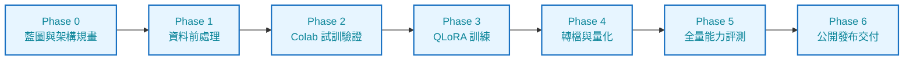
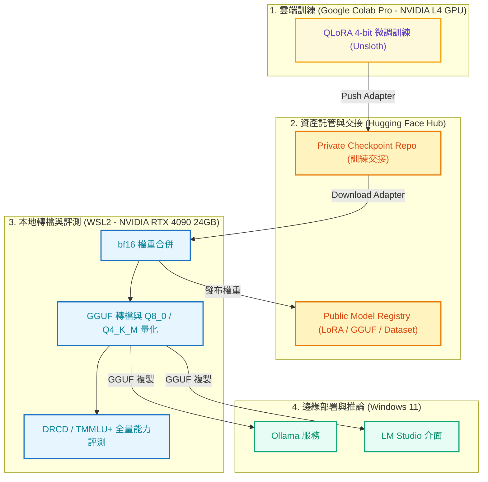

# local-llm-lifecycle

[](https://github.com/kuotunyu/local-llm-lifecycle/actions/workflows/ci.yml)


[](https://huggingface.co/steven0226)
[](LICENSE)

本專案實作開源大型語言模型全生命週期 (End-to-End LLM Lifecycle) 工程方法論：從 [DRCD](https://github.com/DRCKnowledgeTeam/DRCD) 繁體中文閱讀理解資料集前處理、Google Colab Pro (NVIDIA L4) 進行 `Qwen/Qwen3-8B` QLoRA 微調、本機環境 (Windows 11 + WSL2 + RTX 4090) 進行 bf16 模型合併、GGUF 轉檔與 Q8_0 / Q4_K_M 量化、部署至 Ollama 與 LM Studio，最終完成評測與發布至 Hugging Face Hub。

---

## 關鍵結論與經驗反思

| 問題 | 答案 | 樣本與統計 |
|---|---|---|
| 量化會吃掉多少微調效果？ | **最多 0.65%**（95% CI 上界，不是點估計） | n=4,699，未抽樣，配對 bootstrap |
| 微調犧牲多少通用能力？ | **−3.32 pp**（不是我原本公開宣稱的 −12.25） | n=20,118，95% CI [−3.96, −2.69]，McNemar p=8.9×10⁻⁴⁵ |
| 那個退步救得回來嗎？ | **45% 可以**，靠選項順序隨機化投票 | 160,880 次推論，+1.54 pp，CI [+0.90, +2.19] |

### 核心發現與方法學翻轉

1. **小樣本抽樣偏差之修正**：
   初版採用 200 題 (每科 3 題) 抽樣測出 −12.25 pp，誤判為劇烈災難性忘卻 (Catastrophic Forgetting)。全量 20,118 題重跑後，真實退步幅度校正為 −3.32 pp。此經驗證明非隨機固定前幾題抽樣會嚴重歪曲 Bootstrap 信賴區間估計。
2. **位置偏誤與選項位移 (Option Permutation)**：
   研究發現微調後模型出現作答位移 (B ➔ D 位移)，選 B 減少 1,946 次而選 D 增加 1,889 次，導致 Gold=B 答對率下降 16.9 pp 但 Gold=D 答對率反向提升 7.7 pp。透過 4 次選項順序隨機化投票 (Majority Voting)，成功救回 45% 的效能損失。
3. **無損量化 (Quantization Equivalence Boundaries)**：
   Q4_K_M 量化相較於未量化微調模型，整體 EM 差異僅 +0.043 pp (95% CI [−0.30, +0.38])。量化最多僅吃掉微調增益的 0.65%，證明 Q4 量化在工業部署上具備極高可行性。

---

## 系統架構與 Pipeline

### 1. 六階段開發與生命週期 Pipeline



### 2. 跨平台與硬體資產流向



---

## 實驗評測與對照組

在 DRCD Development Set (全量 4,699 題) 上進行五組對照實驗：

| 組別 | 實驗說明 | Overall Exact Match (EM) | Overall F1-Score | JSON 結構化合法率 |
|---|---|---:|---:|---:|
| **1. Base Zero-shot** | 原廠 Qwen3-8B 基準 | 0.4756 | 0.6858 | 95.6% |
| **2. Base Few-shot** | 3-shot Prompting 基準 | 0.8253 | 0.9191 | 99.98% |
| **3. FT 未量化** | 微調增益性能上限 (bf16) | **0.9325** | **0.9704** | **100.0%** |
| **4. FT Q8_0** | GGUF 轉檔損耗探針 | 0.9328 | 0.9706 | 100.0% |
| **5. FT Q4_K_M** | 實際部署版本 | **0.9330** | **0.9700** | **100.0%** |

詳細評測報告與單元錯誤分析見 [EVAL_REPORT.md](EVAL_REPORT.md)。

---

## 公開資產與權重

| 資產類型 | 託管連結 | 授權條款 |
|---|---|---|
| **LoRA Adapter** | [steven0226/Qwen3-8B-DRCD-zhTW-QA-LoRA](https://huggingface.co/steven0226/Qwen3-8B-DRCD-zhTW-QA-LoRA) | Apache-2.0 |
| **GGUF (Q8_0 / Q4_K_M)** | [steven0226/Qwen3-8B-DRCD-zhTW-QA-GGUF](https://huggingface.co/steven0226/Qwen3-8B-DRCD-zhTW-QA-GGUF) | Apache-2.0 |
| **SFT Dataset** | [steven0226/drcd-zhtw-extractive-qa-sft](https://huggingface.co/datasets/steven0226/drcd-zhtw-extractive-qa-sft) | CC BY-SA 4.0 |
| **訓練監控紀錄** | [W&B Run 頁面](https://wandb.ai/tunyu1/qwen3-drcd-qlora/runs/e8h2wq6x) | N/A |

---

## 快速開始

### 1. Ollama 部署與推論 (推薦)

```bash
# 1. 從 Hugging Face 貼文直接拉取 GGUF Q4 量化模型
ollama pull hf.co/steven0226/Qwen3-8B-DRCD-zhTW-QA-GGUF:Q4_K_M

# 2. 執行命令列推論 (建議關閉思考鏈以取得抽取式 QA 最佳效果)
ollama run hf.co/steven0226/Qwen3-8B-DRCD-zhTW-QA-GGUF:Q4_K_M --think=false
```

### 2. Transformers & PEFT 程式碼載入

```python
import torch
from peft import PeftModel
from transformers import AutoModelForCausalLM, AutoTokenizer

base_model = AutoModelForCausalLM.from_pretrained(
    "unsloth/Qwen3-8B", torch_dtype=torch.bfloat16, device_map="auto"
)
model = PeftModel.from_pretrained(base_model, "steven0226/Qwen3-8B-DRCD-zhTW-QA-LoRA")
tokenizer = AutoTokenizer.from_pretrained("steven0226/Qwen3-8B-DRCD-zhTW-QA-LoRA")
```

---

## 評測結果重現

專案提供自動化腳本驗證所有統計數據與圖表：

```bash
# 執行統計數據完整驗證與 CI 測試 (無需 GPU)
python3 scripts/57_verify_published_numbers.py

# 執行選項位移理論檢定
python3 scripts/54_test_option_permutation.py
```

| 驗證項目 | 執行腳本 | GPU 需求 |
|---|---|---|
| **數據全量自動稽核 (CI 預設)** | `python3 scripts/57_verify_published_numbers.py` | 無需 GPU (秒級) |
| **選項順序位移驗證** | `python3 scripts/54_test_option_permutation.py` | 無需 GPU (秒級) |
| **TMMLU+ 配對檢定** | `python3 scripts/52_tmmlu_paired_stats.py --out-dir results/eval_raw` | 無需 GPU |
| **DRCD 等價界檢定** | `python3 scripts/56_drcd_paired_stats.py --eval-dir results/eval_raw` | 無需 GPU |
| **TMMLU+ 全量推論 (20,118 題)** | `python3 scripts/51_eval_tmmlu.py --full --groups all` | 需 GPU (約 15 分鐘) |

---

## 專案結構

| 目錄 / 檔案 | 內容規範與職責 |
|---|---|
| `EVAL_REPORT.md` | 評測報告：五組對照、能力忘卻分析、錯誤案例與統計圖表 |
| `data/` | DRCD 資料集下載、負例合成與 SFT jsonl 轉換 |
| `notebooks/` | Google Colab Pro QLoRA 訓練指令與設定 |
| `scripts/` | 模型合併、GGUF 轉檔、量化、驗證與評測自動化腳本 |
| `deploy/` | Ollama Modelfile 與 LM Studio 部署說明 |
| `results/` | 評測 JSONL 紀錄、統計 CSV 與分析圖表 |

---

## 授權與引用

本專案模型權重採 **Apache-2.0 License**。SFT 資料集採用 **CC BY-SA 4.0** (DRCD 改編作品，原著歸屬 Delta Research Center)。完整文檔請參閱 [EVAL_REPORT.md](EVAL_REPORT.md)。
