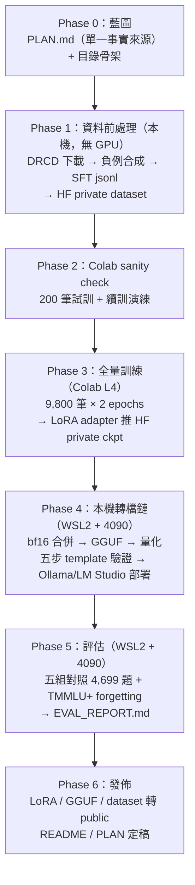
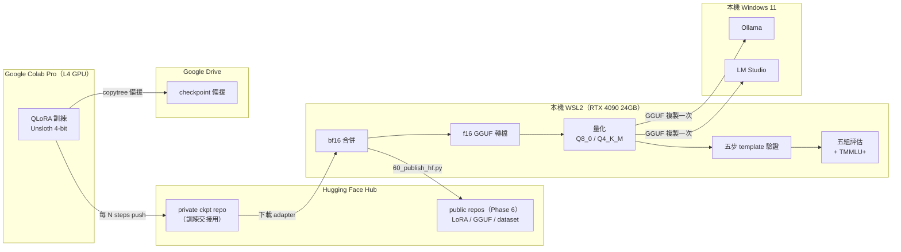

# 開源模型全生命週期：Colab QLoRA → GGUF 量化 → Ollama/LM Studio 部署 → HF 發佈

把 `Qwen/Qwen3-8B` 用 [DRCD](https://github.com/DRCKnowledgeTeam/DRCD) 做繁體中文抽取式閱讀理解
（extractive QA）的 QLoRA 微調（Colab），回本機（Win11 + WSL2 + RTX 4090）合併、轉 GGUF、量化、
部署到 Ollama / LM Studio，正式發佈到 Hugging Face，並以五組對照實驗回答核心問題：
**「量化會吃掉多少微調效果？」**

**答案：幾乎不會。** 量化到 Q4_K_M 部署版之後，微調帶來的 EM 增益幾乎完全保留。微調本身則讓
模型在 TMMLU+ 通用知識測驗上掉了 3.3 個百分點——而且退步的型態是**選項偏誤**（微調後少選 B、
多選 D），不是通用知識被抹除。

## 五組對照結果（DRCD dev，完整 4,699 題）

| # | 組別 | overall EM | overall F1 | JSON 合法率 |
|---|------|-----------:|-----------:|-------------:|
| 1 | base zero-shot（原廠） | 0.4756 | 0.6858 | 95.6% |
| 2 | base few-shot（3-shot） | 0.8253 | 0.9191 | 99.98% |
| 3 | **FT 未量化**（微調增益上限） | **0.9325** | **0.9704** | 100.0% |
| 4 | FT Q8_0（轉檔損耗探針） | 0.9328 | 0.9706 | 100.0% |
| 5 | **FT Q4_K_M**（實際部署版） | **0.9330** | **0.9700** | 100.0% |

量化幾乎沒有吃掉微調效果：（組5−組1）= 0.4574 EM ≈（組3−組1）= 0.4569 EM。

**TMMLU+ forgetting check**（66 科目、test split 全量 **20,118 題**，base vs FT 同在 bf16 下比）：
macro accuracy 0.5936 → 0.5604，**Δ = −3.32 個百分點，95% CI [−3.96, −2.69]**
（配對分層 bootstrap 10,000 次；McNemar 精確檢定 p = 8.9×10⁻⁴⁵）。

退步的機制是**選項偏誤**而非知識遺忘：微調後模型選 B 的次數少了 1,946 次、選 D 多了 1,889 次，
於是 gold=B 的題目掉 16.9 pp，而 **gold=D 的題目反而進步 7.7 pp**。忘掉知識的模型不會在某個
子集上變強。

進一步用 160,880 次推論實測「這個偏誤有多少校正得回來」：把選項內容做循環位移、讓正確答案
輪流落在 A/B/C/D 再投票，**回收了 45% 的退步**（+1.54 pp，95% CI [+0.90, +2.19]）。
而且偏誤**撐過了位移**（FT 位移後仍只有 14.7% 選 B、32.2% 選 D，與位移前幾乎一致），
證明它是位置偏誤而不是集成效應。剩下的約 1.9 pp 只能說「不是位置偏誤」，
**不能**反推是知識遺忘——內容型偏誤在這個設計裡沒有被檢定。

> **這份報告修正過自己**：先前版本用 200 題（每科 3 題）得到 −12.25 pp、宣稱「明顯的
> catastrophic forgetting」。全量重跑後量級只有 −3.32 pp，而且舊版列為「略有進步」的科目
> （`general_principles_of_law`）在全量下是**退步最嚴重的一科**（−11.3 pp）。
> 錯在哪的完整剖析見 [EVAL_REPORT.md §4.3](EVAL_REPORT.md#43-先前-200-題版本錯在哪)。

完整方法論、逐組分析、5 個錯誤案例、W&B 訓練曲線 → 見 [EVAL_REPORT.md](EVAL_REPORT.md)。

## Pipeline

六個 Phase，每個結束都停下確認才進下一個（細節與踩雷見 PLAN.md 各 Phase「實作紀錄」）：



環境分工：**Colab 只負責訓練，其他一切在本機**；訓練產出用 HF private repo 交接（Drive 備援）；
GGUF 只複製到 Windows 一次（WSL↔Windows 的 9P 橋接慢 3-5 倍，部署端不能直接讀 WSL 路徑）。



更詳細的資料處理、斷線續訓、GGUF 陷阱、五步驗證等機制圖，見 PLAN.md 對應章節（§4.7、§7）。

## 已發佈資產

| 資產 | 連結 | 授權 |
|------|------|------|
| LoRA adapter | [steven0226/Qwen3-8B-DRCD-zhTW-QA-LoRA](https://huggingface.co/steven0226/Qwen3-8B-DRCD-zhTW-QA-LoRA) | Apache-2.0 |
| GGUF（Q8_0 / Q4_K_M） | [steven0226/Qwen3-8B-DRCD-zhTW-QA-GGUF](https://huggingface.co/steven0226/Qwen3-8B-DRCD-zhTW-QA-GGUF) | Apache-2.0 |
| SFT dataset | [steven0226/drcd-zhtw-extractive-qa-sft](https://huggingface.co/datasets/steven0226/drcd-zhtw-extractive-qa-sft) | CC BY-SA 4.0 |
| 訓練曲線 | [W&B run](https://wandb.ai/tunyu1/qwen3-drcd-qlora/runs/e8h2wq6x) | — |

## Quickstart

### Ollama（最快）

```bash
ollama pull hf.co/steven0226/Qwen3-8B-DRCD-zhTW-QA-GGUF:Q4_K_M
ollama run hf.co/steven0226/Qwen3-8B-DRCD-zhTW-QA-GGUF:Q4_K_M --think=false
```

輸入格式（system prompt + user 訊息）見 [deploy/Modelfile](deploy/Modelfile)、
[deploy/OLLAMA.md](deploy/OLLAMA.md)。

### transformers + PEFT

```python
from transformers import AutoModelForCausalLM, AutoTokenizer
from peft import PeftModel
import torch

base = AutoModelForCausalLM.from_pretrained(
    "unsloth/Qwen3-8B", dtype=torch.bfloat16, device_map="cuda"
)
model = PeftModel.from_pretrained(base, "steven0226/Qwen3-8B-DRCD-zhTW-QA-LoRA")
tokenizer = AutoTokenizer.from_pretrained("steven0226/Qwen3-8B-DRCD-zhTW-QA-LoRA")
```

完整用法（llama.cpp / LM Studio）見各 HF repo model card。

## 專案結構與文件

```
├── PLAN.md              # 單一事實來源：藍圖 + 每 Phase 實作紀錄 + §7 設計理由/踩雷敘事（含圖解）
├── EVAL_REPORT.md         # 五組對照 + forgetting + 錯誤案例分析（含圖表）
├── data/                 # DRCD 下載/負例合成/SFT jsonl 建置
├── notebooks/             # Colab QLoRA 訓練 notebook
├── scripts/               # 本機合併/轉檔/量化/驗證/評估/發佈腳本
├── deploy/                # Ollama / LM Studio 部署設定與說明
└── results/               # 評估輸出（json/csv/圖表）
```

只有 3 份頂層文件，各自負責不重疊的內容：README（總覽/quickstart）、PLAN（完整過程：藍圖 →
每 Phase 實作紀錄 → 設計理由與踩雷敘事，含所有 mermaid 圖解）、EVAL_REPORT（評估數字與圖表）。
想先看圖再看文字，直接看 PLAN.md §7 跟本頁的 pipeline 圖。

## 授權

- 模型權重（LoRA / GGUF）：Apache-2.0
- SFT dataset：CC BY-SA 4.0（DRCD 改編作品，歸屬 Delta Research Center，引用
  [arXiv:1806.00920](https://arxiv.org/abs/1806.00920)）
- 基底模型：`unsloth/Qwen3-8B`（Apache-2.0，歸屬 Qwen team / unsloth）
