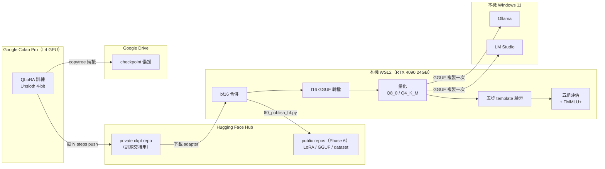

# 開源模型全生命週期：Colab QLoRA → GGUF 量化 → Ollama/LM Studio 部署 → HF 發佈

把 `Qwen/Qwen3-8B` 用 [DRCD](https://github.com/DRCKnowledgeTeam/DRCD) 做繁體中文抽取式閱讀理解
（extractive QA）的 QLoRA 微調（Colab），回本機（Win11 + WSL2 + RTX 4090）合併、轉 GGUF、量化、
部署到 Ollama / LM Studio，正式發佈到 Hugging Face。

## 三個結論，兩個是我自己推翻的

| 問題 | 答案 | 樣本與統計 |
|---|---|---|
| 量化會吃掉多少微調效果？ | **最多 0.65%**（95% CI 上界，不是點估計） | n=4,699，未抽樣，配對 bootstrap |
| 微調犧牲多少通用能力？ | **−3.32 pp**（不是我原本公開宣稱的 −12.25） | n=20,118，95% CI [−3.96, −2.69]，McNemar p=8.9×10⁻⁴⁵ |
| 那個退步救得回來嗎？ | **45% 可以**，靠選項順序隨機化投票 | 160,880 次推論，+1.54 pp，CI [+0.90, +2.19] |

**第一列是這個專案原本要回答的問題，後面兩列是我把自己的答案推翻兩次的結果。**

**推翻一：已經公開的結論是錯的，而且不只是「雜訊大」。**
初版用 200 題（每科 3 題）得到 −12.25 pp，宣稱「明顯的 catastrophic forgetting」。全量 20,118 題
重跑後是 −3.32 pp——**落在舊資料算出的 95% CI [−16.5, −8.0] 之外**。原因是舊抽樣每科固定取
test split 的前 3 題，不是隨機抽，而 bootstrap CI 的前提正是隨機抽樣：那個 CI 看起來漂亮地
排除了 0，但它量錯了對象。舊版列為「略有進步」的科目（`general_principles_of_law`），
全量下是**退步最嚴重的一科**（−11.3 pp）。→ [EVAL_REPORT §4.3](EVAL_REPORT.md#43-先前-200-題版本錯在哪)

**推翻二：發表前攔下一個會製造假陽性的指標。**
校正實驗原本指定「位移平均」當主指標。跑之前的對抗性稽核發現：在 gold 邊際均勻的 benchmark 上，
它對選項偏誤的回收量**恆等於 0**——那是代數恆等式，跟模型有沒有偏誤無關。照原計畫發表會得到
「攤平位置效應後退步還在，所以是真的知識損失」這種被公式逼出來、看起來很有力的錯誤結論。
改用多數決，並把這個盲點寫成回歸測試：有人改回去，測試就會失敗。
→ [`scripts/54_test_option_permutation.py`](scripts/54_test_option_permutation.py)

退步的機制不是知識遺忘，是 **B→D 的作答位移**：微調後選 B 少 1,946 次、選 D 多 1,889 次，
於是 gold=B 掉 16.9 pp，而 **gold=D 反而進步 7.7 pp**——忘掉知識的模型不會在某個子集上變強。
偏誤撐過了循環位移（位移後 FT 仍只有 14.7% 選 B），確認是位置而非內容驅動；
最可疑的內容維度（選項長度）也檢定過，比位置效應小 2.7 倍。

剩下的約 1.9 pp **仍不能**反推是知識遺忘——其餘內容特徵尚未檢定。推論邊界寫在
[EVAL_REPORT 第 6 節](EVAL_REPORT.md)，跟結論放在一起。

```bash
python3 scripts/54_test_option_permutation.py
```

clone 下來就能跑，不需要 GPU、不需要下載模型——上面「推翻二」那條回歸測試就在裡面。

## 五組對照結果（DRCD dev，完整 4,699 題）

| # | 組別 | overall EM | overall F1 | JSON 合法率 |
|---|------|-----------:|-----------:|-------------:|
| 1 | base zero-shot（原廠） | 0.4756 | 0.6858 | 95.6% |
| 2 | base few-shot（3-shot） | 0.8253 | 0.9191 | 99.98% |
| 3 | **FT 未量化**（微調增益上限） | **0.9325** | **0.9704** | 100.0% |
| 4 | FT Q8_0（轉檔損耗探針） | 0.9328 | 0.9706 | 100.0% |
| 5 | **FT Q4_K_M**（實際部署版） | **0.9330** | **0.9700** | 100.0% |

量化幾乎沒有吃掉微調效果：（組5−組1）= 0.4573 EM ≈（組3−組1）= 0.4569 EM。
組4 的角色是把損耗來源拆開——組4≈組3 代表 GGUF 轉檔無損，組5≈組4 代表 Q8→Q4 量化無損。

這是 null result，所以給等價界而不只是點估計：Q4 vs 未量化的 Δ EM = +0.043 pp，
95% CI [−0.30, +0.38]——**量化最多吃掉微調增益的 0.65%**（CI 下界 ÷ 增益 45.69 pp）。

**但量化不是 no-op**：Q4 有 **126/4,699（2.68%）題的答案文字與 bf16 不同**，
只是變好 33 題、變壞 35 題互相抵銷（McNemar p=0.90），整體指標才看起來沒動。
正確的說法是「量化的影響沒有方向性」，不是「量化沒有影響」。→ [EVAL_REPORT §3.1–3.2](EVAL_REPORT.md)

完整方法論、逐組分析、5 個錯誤案例、W&B 訓練曲線 → 見 [EVAL_REPORT.md](EVAL_REPORT.md)。

## Pipeline

六個 Phase，每個結束都停下確認才進下一個（細節與踩雷見 PLAN.md 各 Phase「實作紀錄」）：

```mermaid
flowchart TB
    P0["Phase 0：藍圖<br>PLAN.md（單一事實來源）+ 目錄骨架"]
    P1["Phase 1：資料前處理（本機，無 GPU）<br>DRCD 下載 → 負例合成 → SFT jsonl<br>→ HF private dataset"]
    P2["Phase 2：Colab sanity check<br>200 筆試訓 + 續訓演練"]
    P3["Phase 3：全量訓練（Colab L4）<br>9,800 筆 × 2 epochs<br>→ LoRA adapter 推 HF private ckpt"]
    P4["Phase 4：本機轉檔鏈（WSL2 + 4090）<br>bf16 合併 → GGUF → 量化<br>五步 template 驗證 → Ollama/LM Studio 部署"]
    P5["Phase 5：評估（WSL2 + 4090）<br>五組對照 4,699 題 + TMMLU+ forgetting<br>→ EVAL_REPORT.md"]
    P6["Phase 6：發佈<br>LoRA / GGUF / dataset 轉 public<br>README / PLAN 定稿"]
    P0 --> P1 --> P2 --> P3 --> P4 --> P5 --> P6
```



環境分工：**Colab 只負責訓練，其他一切在本機**；訓練產出用 HF private repo 交接（Drive 備援）；
GGUF 只複製到 Windows 一次（WSL↔Windows 的 9P 橋接慢 3-5 倍，部署端不能直接讀 WSL 路徑）。



更詳細的資料處理、斷線續訓、GGUF 陷阱、五步驗證等機制圖，見 PLAN.md 對應章節（§4.7、§7）。

## 已發佈資產

| 資產 | 連結 | 授權 |
|------|------|------|
| LoRA adapter | [steven0226/Qwen3-8B-DRCD-zhTW-QA-LoRA](https://huggingface.co/steven0226/Qwen3-8B-DRCD-zhTW-QA-LoRA) | Apache-2.0 |
| GGUF（Q8_0 / Q4_K_M） | [steven0226/Qwen3-8B-DRCD-zhTW-QA-GGUF](https://huggingface.co/steven0226/Qwen3-8B-DRCD-zhTW-QA-GGUF) | Apache-2.0 |
| SFT dataset | [steven0226/drcd-zhtw-extractive-qa-sft](https://huggingface.co/datasets/steven0226/drcd-zhtw-extractive-qa-sft) | CC BY-SA 4.0 |
| 訓練曲線 | [W&B run](https://wandb.ai/tunyu1/qwen3-drcd-qlora/runs/e8h2wq6x) | — |

## Quickstart

### Ollama（最快）

```bash
ollama pull hf.co/steven0226/Qwen3-8B-DRCD-zhTW-QA-GGUF:Q4_K_M
ollama run hf.co/steven0226/Qwen3-8B-DRCD-zhTW-QA-GGUF:Q4_K_M --think=false
```

輸入格式（system prompt + user 訊息）見 [deploy/Modelfile](deploy/Modelfile)、
[deploy/OLLAMA.md](deploy/OLLAMA.md)。

### transformers + PEFT

```python
from transformers import AutoModelForCausalLM, AutoTokenizer
from peft import PeftModel
import torch

base = AutoModelForCausalLM.from_pretrained(
    "unsloth/Qwen3-8B", dtype=torch.bfloat16, device_map="cuda"
)
model = PeftModel.from_pretrained(base, "steven0226/Qwen3-8B-DRCD-zhTW-QA-LoRA")
tokenizer = AutoTokenizer.from_pretrained("steven0226/Qwen3-8B-DRCD-zhTW-QA-LoRA")
```

完整用法（llama.cpp / LM Studio）見各 HF repo model card。

## 復現評估數字

本報告所有數字都可以重跑。環境版本見 [requirements.txt](requirements.txt)
（實測：Python 3.12.3、torch 2.11.0+cu130、RTX 4090 24GB、WSL2 Ubuntu 24.04、driver 591.86）。

**不需要 GPU** 的部分——逐題結果已進 git，統計可以直接重算：

```bash
python3 scripts/52_tmmlu_paired_stats.py --out-dir results/eval_raw
```

輸出 Δ macro、配對分層 bootstrap 的 95% CI、McNemar 精確檢定、逐科目 CI 與選項偏誤診斷，
應與 [results/tmmlu_paired_stats.json](results/tmmlu_paired_stats.json) 一致。

**需要 GPU** 的部分（TMMLU+ 全量 20,118 題 × 2 個權重，4090 上約 15 分鐘）：

```bash
python3 scripts/51_eval_tmmlu.py --full --groups all --base-model unsloth/Qwen3-8B --merged-dir <合併後的 bf16 目錄> --out-dir results/eval_raw
```

考卷（`results/eval_raw/tmmlu_sample.json`，8.9 MB）**沒有進 git**——它是
`ikala/tmmluplus` test split（MIT）的逐字副本，由上面這條指令決定性重建，SHA-256 可核對。
逐題**結果**有進 git，`qid` 格式是 `<科目>-<test split 列序>`，拿 qid 就能回查原題。
另外提交了 `results/eval_raw/tmmlu_testset.json`（2,000 題平衡子集，四個 gold 字母各 500），
只為了讓下面那支驗證測試在乾淨 clone 下也跑得起來。

| 想重跑什麼 | 指令 | clone 後可直接跑？ |
|---|---|---|
| 置換邏輯的驗證測試 | `54_test_option_permutation.py` | **可以**（用 committed 子集，數秒） |
| TMMLU+ 配對檢定與 CI | `52_tmmlu_paired_stats.py --out-dir results/eval_raw` | **可以**（逐題結果已進 git） |
| 選項位移校正（§4.4） | `54_tmmlu_option_permutation.py --analyze --compact results/eval_perm/permutation_predictions.jsonl` | **可以**（緊湊逐題預測已進 git） |
| DRCD 等價界（§3.1–3.2） | `56_drcd_paired_stats.py --eval-dir results/eval_raw` | **可以**（五組逐題結果已進 git） |
| 位置 vs 內容長度偏誤（§4.5） | `55_content_bias_check.py --compact …` | 需先重建考卷（無 GPU，一行指令） |
| batch 組成敏感度 | `53_batch_sensitivity.py --dir-a … --dir-b …` | 需先自行跑第二組 batch 設定 |
| TMMLU+ 全量推論 | `51_eval_tmmlu.py --full` | 需 GPU（約 15 分） |
| 選項位移全量推論 | `54_…py --build` 後接 `51_…py --full` | 需 GPU（約 45 分） |
| DRCD 五組對照 | `50_eval_qa.py --groups all` | 需 GPU |

位移實驗的逐題預測以**緊湊格式**進 git（`results/eval_perm/permutation_predictions.jsonl`，
1.3 MB）：一行一題，`base` / `ft` 各是 4 個字元，第 k 個字元＝該模型在位移 k 上答的位置字母。
原始輸出是 22.1 MB，但其中大半是重複的 JSON key 名稱與可推導欄位（subject 可從 qid 推出、
位移 k 的 gold 可從原始 gold 推出、correct 可由兩者比對），壓縮 16.8 倍後對下游統計**無損**
——實測從緊湊格式重算 §4.4 與 §4.5，與原始檔的輸出**逐欄完全相同**。

最快確認這個 repo 的統計不是空話：clone 下來直接跑

```bash
python3 scripts/54_test_option_permutation.py
```

它用行為已知的假模型當 oracle 斷言指標的理論值，其中一條鎖住了本專案發表前攔下的錯誤
（「位移平均」在 gold 均勻時量不到選項偏誤，回收量恆為 0）——有人把主指標改回去，測試就會失敗。

**注意**：跑 `54_…py --build` 時 `--out-dir` 不要指向 `results/` 底下
（腳本會擋，因為 `51_eval_tmmlu.py` 會把彙總寫到 `out_dir.parent`，會覆蓋正式結果檔）。

## 專案結構與文件

```
├── PLAN.md              # 單一事實來源：藍圖 + 每 Phase 實作紀錄 + §7 設計理由/踩雷敘事（含圖解）
├── EVAL_REPORT.md         # 五組對照 + forgetting + 錯誤案例分析（含圖表）
├── data/                 # DRCD 下載/負例合成/SFT jsonl 建置
├── notebooks/             # Colab QLoRA 訓練 notebook
├── scripts/               # 本機合併/轉檔/量化/驗證/評估/發佈腳本
├── deploy/                # Ollama / LM Studio 部署設定與說明
└── results/               # 評估輸出（json/csv/圖表）
```

只有 3 份頂層文件，各自負責不重疊的內容：README（總覽/quickstart）、PLAN（完整過程：藍圖 →
每 Phase 實作紀錄 → 設計理由與踩雷敘事，含所有 mermaid 圖解）、EVAL_REPORT（評估數字與圖表）。
想先看圖再看文字，直接看 PLAN.md §7 跟本頁的 pipeline 圖。

## 授權

- 模型權重（LoRA / GGUF）：Apache-2.0
- SFT dataset：CC BY-SA 4.0（DRCD 改編作品，歸屬 Delta Research Center，引用
  [arXiv:1806.00920](https://arxiv.org/abs/1806.00920)）
- 基底模型：`unsloth/Qwen3-8B`（Apache-2.0，歸屬 Qwen team / unsloth）
